# Vue模块篇

***陈华旺-chenhuawang@itany.com***

[TOC]

## 1、组件化与模块化

+ 什么是模块化？
  + 将一个复杂的程序依据一定的规则(规范)封装成几个块(文件), 并进行组合使用
  + 块(文件)的内部数据与实现是私有的, 只是向外部暴露一些接口(方法)与外部其它模块通信交换
+ 什么是组件化？
  + 组件是以项目页面构成，将页面进行单元文件查分，用于复用重组页面结构
  + 组件包含页面构成(template)，样式(css)，功能(js+模块调用)
+ 组件和模块

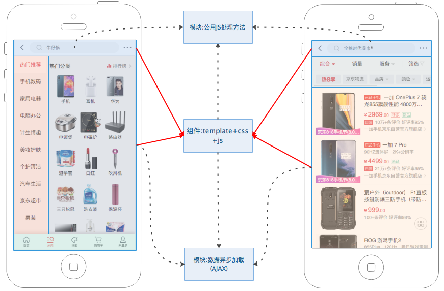

+ 模块化优点(可维护性)
  1. 灵活架构，焦点分离
  2. 方便模块间组合、分解
  3. 方便单个模块功能调试、升级
  4. 多人协作互不干扰
+ 模块化缺点(性能损耗)
  1. 系统分层，调用链会很长
  2. 模块间通信,模块间发送消息会很耗性能

## 2、模块化环境构建

### 2.1、模块环境分类

+ 页面环境：传统页面构建模块化环境，主要基于模块化插件 `RequireJS` 、`CommonJS` 和  `SeaJS`
  + AMD (Asynchronous Module Definition-异步模块定义):
    + ==是RequireJS提出的==一个**依赖前置、异步定义**的模块化加载框架，在构建功能的同时如果需要用到别的模块，需在最前面定义好模块文件的引入。
  + CMD (Common Module Definition通用模块定义):
    + 是淘宝团队开发的==SeaJS提出的==一个**依赖就近，同步加载**的模块框架，在构建功能时什么地方使用到模块，就在什么地方加载模块，即用即返。
  + CommonJS (通用JS)
    + CommonJS是一个JS开发的统一规范定义，该规范致力于提供一个类似java、python等语言的标准库，使JS可以开发服务器端应用程序、命令行工具、桌面图形界面应用程序
    + NodeJS 就是基于 CommonJS 规范构建的一套基于服务器端的模块系统架构
+ 独立环境构建(开发环境构建)
  + 多数前端模块框架都需要基于一个固定的开发环境，构建独立的模块开发系统，这些系统多数都基于 NodeJS 和 webpack 进行环境搭建
    + NodeJS 独立JS运行环境和模块系统支持
    + webpack 前端构成工作流工具库

### 2.2、Vue模块化独立环境搭建

#### 1、`@vue/cli` 脚手架

+ Vue模块化项目环境，可以通过官方提供的环境构建起 `vue-cli` 进行自动创建

+ 环境依赖检测

  + node环境：`node -v`
  + npm环境：`npm -v`
  + nrm环境：` nrm ls`
    + nrm 安装 `npm install nrm -g` （要使用管理员权限 ：windows 系统右键 ，mac|liunx `sudo npm install nrm -g` `）
    + `nrm user 地址名称`进行切换

+ 脚手架安装

  + 提供通过命令行的方式快速 构建 vue 运行环境项目
  + cli ： commond line interface 命令行接口
  + **通过npm 方式安装创建 `[sudo] npm install @vue/cli -g`**
    - 系统命令行工具将创建一个主命令 `vue`，通过  `vue -V` 验证安装状态和版本
    - `vue --help` `vue -h` 查看vue环境的帮助手册

  ```powershell
  C:\Users\User>vue --help
  Usage: vue <command> [options]
  
  Options:
    -V, --version                              查看当前vue\cli版本号
    -h, --help                                 在控制台输出帮助命令
  
  Commands:
  	命令行中 [] 表示可选命令   <> 表必须命令
    * create [options] <app-name>  根据开发者提供的项目名称创建项目，
                      项目名称 不能使用驼峰方式
                      项目名称 最好不要使用中文
    * add [options] <plugin> [pluginOptions] 为项目增加扩展插件功能
    											==>npm install <plugin>
    																						自动识别     --save   --save-dev 自动安装依赖
    invoke [options] <plugin> [pluginOptions] 对项目中的插件进行 配置更新
    inspect [options] [paths...]  调整脚手架服务器的配置
    * serve [options] [entry]   驱动简易的vue环境  == npm run serve
    * build [options] [entry]   基于webpack打包项目-将JS CSS html …… 语法转换为兼容语法
    										生成 纯静态文件 vue build == npm run build
    * ui [options]   开启 vue-cli 管理器页面 -- 通过图形化管理电脑中的所有vue项目
    init [options] <template> <app-name>      根据外部模板创建功能（vue-cli 2.0 版本项目构建）旧项目结构-依赖于 npm install -g @vue/cli-init
    config [options] [value]                  配置文件的修改操作
    upgrade [semverLevel]                     vue项目的配置升级
    info                                      用于启动查看 调试信息
  
    Run vue <command> --help 查看子命令的帮助手册
  ```

#### 2、基于`@vue/cli`创建模块项目

1. **切换到需要存放项目的目录**
2. **在正确的目录下执行 `vue create 项目名称`**，注意：项目名称不能出现驼峰方式，不要定义中文字符
   + 上述命令执行后会进入 REPL(可交互控制台) 环境

```powershell
# 1、选择构建模式
Vue CLI v3.10.0
? Please pick a preset: (Use arrow keys)
	- 开发者进行操作时，可以对该列表进行定义和配置
❯ default (babel, eslint)  # 默认选项（只包含基础选项）
  Manually select features # 自定义环境选择
#2、选择 自定义环境 构建后
Vue CLI v3.10.0
? Please pick a preset: Manually select features
? Check the features needed for your project: (Press <space> to select, <a> to toggle all, <i> to invert selection) # 选择环境支持语法
❯◉ Babel # ES高阶 语法 到浏览器 兼容 语法 转换器
 ◯ TypeScript # 使用 TS 语法
 ◯ Progressive Web App (PWA) Support # 构建 渐进式WEB应用
 ◯ Router # 集成路由功能
 ◯ Vuex # 集成统一数据状态管理器
 ◯ CSS Pre-processors # 启动 CSS 预编译功能（让项目支持使用 LESS SASS 等动态样式语言）
 ◉ Linter / Formatter # 启用语法校验和格式化检测插件
 ◯ Unit Testing # 启动单元测试（单文件测试）
 ◯ E2E Testing # 启动端到端测试（黑盒测试）
#3、配置完成后，如果选择了对应选项会进入固定的配置选项
#3.1、如果选择了 Router 选项，开启路由模式切换选项
 ? Use history mode for router? (Requires proper server setup for index fallback in production) (Y/n) 
#3.2、如果选择了 CSS Pre-processors ，开启动态语言选择
? Pick a CSS pre-processor (PostCSS, Autoprefixer and CSS Modules are supported by default): (Use arrow keys)
❯ Sass/SCSS (with dart-sass) 
  Sass/SCSS (with node-sass) 
  Less 
  Stylus 
#3.3、如果选择 Linter / Formatter，开启语言校验
? Pick a linter / formatter config: (Use arrow keys)
❯ ESLint with error prevention only # 仅检测错误
  ESLint + Airbnb config  # 使用 Airbnb 前端规范
  ESLint + Standard config # 使用标准规范
  ESLint + Prettier # 使用严格规范
#3.3.1、选择语法校验时间
? Pick additional lint features: (Press <space> to select, <a> to toggle all, <i> to invert selection)
❯◉ Lint on save # 文件保存时
 ◯ Lint and fix on commit # 代码整理和提交时
#3.4、如果选择了 Unit Testing，进入单元测试工具选择
? Pick a unit testing solution: (Use arrow keys)
❯ Mocha + Chai 
  Jest 
#3.5、如果选择了 E2E Testing，进入端到端测试工具选择
? Pick a E2E testing solution: (Use arrow keys)
❯ Cypress (Chrome only) 
  Nightwatch (Selenium-based) 
#4、选择项目构建时，工具配置文件所定义位置
? Where do you prefer placing config for Babel, PostCSS, ESLint, etc.? (Use arrow keys)
❯ In dedicated config files  # 独立文件定义
  In package.json # 集成与 package.json 文件中
#5、是否将上述配置 存储为 一个固定选项，提供下次使用
? Save this as a preset for future projects? Yes
? Save preset as: 随便定义名称
#6、自动进入项目依赖安装--注意：该步骤不执行完成，只会构建文件夹和package.json文件
Vue CLI v3.10.0
✨  Creating project in /Users/appleuser/Desktop/aa-aa.
🗃  Initializing git repository...
⚙  Installing CLI plugins. This might take a while...

⸨ ░░░░░░░░░░░░░░░░░⸩ ⠋ fetchMetadata: sill pacote range manifest for css-loader@^1.0.1 fetched in 525ms
```

#### 3、项目启动

+ 切换到**项目的开发目录**，执行 `npm run serve` 启动项目
  + `npm run 命令名称` 是npm内置的脚本执行命令，该命令会自动搜索执行目录下`package.json`文件中的`script`对应的命令执行
+ 启动完成后会在控制台提示访问地址

```powershell
 DONE  Compiled successfully in 18063ms                                                                  9:04:39 PM
  App running at:
  - Local:   http://localhost:8080/ 
  - Network: http://192.168.0.160:8080/
  Note that the development build is not optimized.
  To create a production build, run npm run build.
```

+ 如果项目目录下模块依赖(node_modules)文件被删除或者丢失,会导致项目无法启动
  + 在项目目录下直接执行 `[sudo] npm install` => 自动搜索运行目录下的 package.json 文件安装所有依赖

## 3、项目结构构成

### 3.1、文件结构

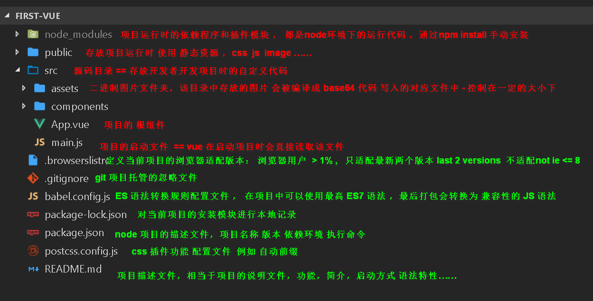


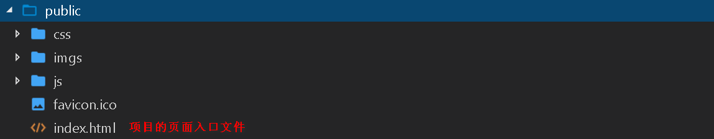

### 3.2、启动流程和组成文件

+ `npm run serve` 命令执行后，会从当前启动目录寻找 vue 项目的主要引导启动文件 `index.html`和`main.js` 文件
+ `npm run serve ` 基于NODE 启动一个为前端工程师进行项目开发的临时开发服务器
  + 启动服务器后，需要装载一个服务器的根地址：**vue项目下   public 目录**

#### 1、index.html

- **index.html 为用户页面入口文件**，为项目通过地址访问时，提供需要展示的HTML静态主页
- 该文件也是vue项目的容器定义文件

```html
<!DOCTYPE html>
<html lang="zh-cn">
  <head>
    <meta charset="utf-8">
    <meta http-equiv="X-UA-Compatible" content="IE=edge">
    <meta name="viewport" content="width=device-width,initial-scale=1.0">
    <!-- 
      <%= BASE_URL %> vue模块项目中提供全局页面构成变量
      BASE_URL 动态服务器地址 == 会因为项目对服务器根地址的配置发生变化
      目的为了自动适配程序开发时 服务器地址的变化
     -->
    <link rel="icon" href="<%= BASE_URL %>favicon.ico">
    <!-- <link rel="stylesheet" href="<%= BASE_URL %>"> -->
    <title>first-project</title>
  </head>
  <body>
    <!-- <h1>测试</h1> -->
    <!-- 检测浏览器是否支持JS代码 -->
    <noscript>
      <strong>We're sorry but first-project doesn't work properly without JavaScript enabled. Please enable it to continue.</strong>
    </noscript>

    <!-- vue构建时使用的容器模板和定位 -->
    <div id="app"></div>
    <!-- built files will be auto injected -->

  </body>
</html>

```

#### 2、main.js

- vue项目的组件、模块整合入口文件，项目启动依赖于当前文件，加载整合和编译获取最终运行的js代码(app.js)
- 生成的整合文件 最终会装载进 index.html 文件中，实现容器和vue的关联

```js
// ES6 的 import from 语法 = 加载外部js文件
//    vue的构成环境基于 node 语法
//    import from 语法 实际上就是 node 语法中 require() 方法 + 解析规则
//    解析规则有框架定义：直接从导入的对象中 加载需要的结果

// const Vue1 = require("vue");
// console.log(Vue1);
// const obj = require("../ccc");
// console.log(obj);

// const obj = require("../ddd");
// console.log(obj);

/*
  require : 加载外部模块（加载外部JS文件的）
  require(arg) arg 怎么取值
    arg 类型为 string
      取值为名称：加载node自带的模块，或者项目目录下 node_modules 中的模块
      取值为地址：./  ../  按照路径寻找需要被加载的文件
                取值为地址，且引入的文件没有定义后缀名称,默认按照 js -> json 方式进行补充
                
      取值对于的模块是一个 文件夹而非文件
        1、先寻找文件夹中是否存在 package.json 文件，如果存在加载文件中 main配置
        2、如果没有package.json 文件，会直接加载该文件夹下的 index.js 文件
        3、如果两个都没有，直接报错

  上述规则 直接继承给了 vue模块项目中  import from 语法
*/

// import 自定义的变量名称 from '需要加载的模块名称|路径地址' 
import Vue from 'vue'  // 加载 vue的核心语法
// console.log("import",Vue);

// vue模块化项目中， 以 .vue 结尾的文件 被称之为 单文件组件
import App from './App.vue'

// 定义Vue的全局配置，配置关闭控太的产品提示
Vue.config.productionTip = false

// 构建vue根实例，启动vue运行
new Vue({
  render: h => h(App),
  // render:function(createElement){
  //   return createElement(App)
  // }
}).$mount('#app')

```

### 3.3、App.vue文件和单文件组件

#### 1、App.vue

+ App.vue文件为模块化项目的基础构成组件-构成页面，该组件用于统一管理vue组件的构成和页面结构

#### 2、单文件组件

+ App.vue 为vue提供的一种特殊的 组件定义文件，该文件用于描述模块化项目中，组件的基本构成代码
  + 包含页面结构 template
  + 组件功能 script
  + 组件样式 style

```vue
<template>
    <!-- 组件模板区 => 定义当前组件的 页面结构 -->
    <div>
    
    </div>
</template>

<script>
    // 定义组件的 配置项
</script>

<style>
    /* 定义组件的 样式 */
</style>
```

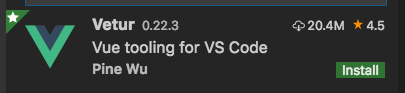

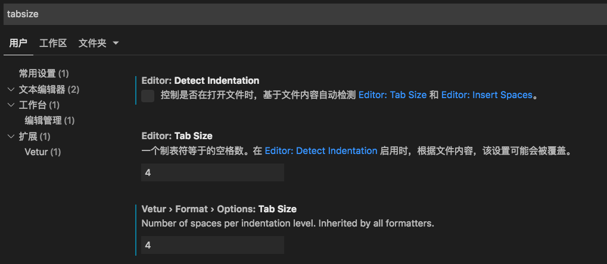

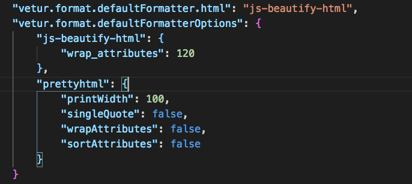

###  3.4、页面构建时的注意事项

- 错误信息的展示
  - 1、系统控制台（cmd）==> 编译错误 模块找不到，标签不对应，环境读取错误
  - 2、HTML页面 ==> HTML 语法错误 , 模块丢失
  - 3、浏览器的控制台 ==> 项目的逻辑代码错误
- 组件开发时的图片路径问题
  - 页面中使用 img 标签方式加载图片，且图片为相对路径，写入的路径会被vue进行加工
    - 在**编译过程中会根据 组件的位置 寻找图片，编译后会使用 baseUrl的值为路径进行重新设置**
  - 在==行内样式==中使用 背景图片方式，图片地址 不会被vue解析编译
    - 图片地址以 index.html 文件作为参考文件
  - 单文件组件中 定义的 css 样式的图片地址 是会被vue进行加工处理的
  - 如果图片的路径地址是以 vue 指令方式进行绑定的，vue在处理图片路径时 不会加工变量值
    - 图片地址以 index.html 文件作为参考文件

##  4、单文件组件中的样式构建

### 4.1、基本样式规则

- 在单文件组件中，提供 style 标签可以完成组件样式的定义 **默认是全局样式定义**
- 单文件组件，可以通过对 `<style scoped>` 标签定义 scoped 属性，完成将样式限制于当前组件的标签上
- 单文件组件在定义样式时，并不限制 style 标签的出现次数

```vue
<style>  全局样式定义
*{
  margin: 0px;
  padding: 0px;
}
</style>

<style scoped>   局部样式定义
  h1{
    color: red;
  }
</style>
```

### 4.2、动态样式

- **为vue项目的单文件组件增加动态语言支持：less (sass sacc) stylus**

  - 组件中的 `style` 标签默认识别css语法
  - 在组件定义时，可以使用 `<style lang="动态样式语言">` 描述当前样式使用何种语言
  - 单文件组件中，一个组件是可以定义多种样式语言特性
  - 项目中需要使用 动态语法，必须为项目安装 动态语法加载器

    - `less` 核心语法包, `less-loader` less的加载器 `npm install less less-loader -D`

      > 为了保证后装的模块可以被项目记录。因此按照时需要指定按照后缀
      >
      > --save | -S  以生产环境记录依赖  （被指定模块项目编译时，对应的JS代码会被写入到app.js文件中）
      >
      > --save-dev | -D 以开发环境记录依赖 （不将依赖模块编译到app.js文件中）

- 项目中less语法的使用

  1. 全局变量定义:在项目的src目录下，任选位置 定义一个 专门存放变量的 less 文件即可

  ```less
  <style lang="less" scoped>
  @import "../less/var.less";  // less语法的 装载 外部less文件
  .content{
      background-color: #dedede;
      border: 1px solid black;
      .title{
          color: @blue;
      }
      .list{
          font-weight: bolder;
          border: 3px solid @blue;
      }
  }
  </style>
  ```

  2. **通过框架配置可以实现,一次加载整个项目都可以使用**

     + 方式1：

       > 添加全局动态样式变量加载器 `style-resources-loader` 
       >
       > 上述插件依赖于 `vue-cli-plugin-style-resources-loader`
       >
       > `npm install style-resources-loader vue-cli-plugin-style-resources-loader -D`
       >
       > 上述方式安装后，需要手动创建 vue项目配置文件 vue.config.js

     + 方式2

       > 也可以直接使用命令**`vue add style-resources-loader`**，进行组合安装
       >
       > ​	1、自动识别插件依赖，进行安装
       >
       > ​	2、自动识别插件的所属依赖环境
       >
       > ​	3、自动构建所需配置
       >
       > ==自动在项目下生成vue.config.js，如果存在该文件，添加配置项==

  3. **修改项目全局启动配置文件 vue.config.js 文件**

     + vue/cli3.0 脚手架 生成的默认项目时没有项目的配置文件vue.config.js
       + 在默认项目下，vue的全局所有属性都具有默认配置，所以不会主动提供全局配置文件vue.config.js
       + 如果成行运行时，需要修改配置，可以通过手动为项目添加vue.config.js 的方式完成配置覆盖修改
     + 可以在项目目录下手动创建 vue.config.js 文件

  ```js
  // node语法自动导出 模块module.exports 
  module.exports = {
    // 三方插件的 加载配置项
    pluginOptions: {
      'style-resources-loader': {
        preProcessor: "less",  // 需要解析的 样式资源后缀
        patterns: [
           // 定义 less 全局样式的文件地址,以当前文件作为参考
           "./src/less/var.less"
        ]  // 定义语法规则
      }
    }
  }
  ```

## 5、模块化的开发规范

- 文件分层：（采用官方建议）组件分层，静态代码分层

  - 组件分层：页面组件，构成组件
    - 页面组件单独存放于一个独立文件夹 views|pages
    - 构成组件 单独存放于一个独立文件夹 components
      - 也可以细分组件文件夹，例如：baseComponents ,viewsComponents……
  - 全局样式定义文件夹，统一存放于 assets 目录下
  - 插件分层：过滤器插件，指令插件，组件插件，……

- 组件名称的定义

  - **组件名应该始终是多个单词的，根组件 App 除外。**

  - 单文件组件的文件名，强烈建议使用驼峰命名法，且首字母大写

    > **单文件组件的文件名应该要么始终是单词大写开头 (PascalCase)，要么始终是横线连接 (kebab-case)。**

- 构成方法时，方法名称应该以方法功能进行描述 ==笔者要求==

## 6、项目打包

- 构建脱离环境依赖和开发服务器的纯静态文件构成的项目，**让项目可以在任意服务器上运行**
- **在项目目录下执行 ：`npm run build` **
  - **上述命令在当前项目目录下生成一个特定文件夹(默认dist)，该文件夹中存放打包后的项目静态文件**
  - **打包后会提供产品报表，记录了生成的文件信息，和大小**

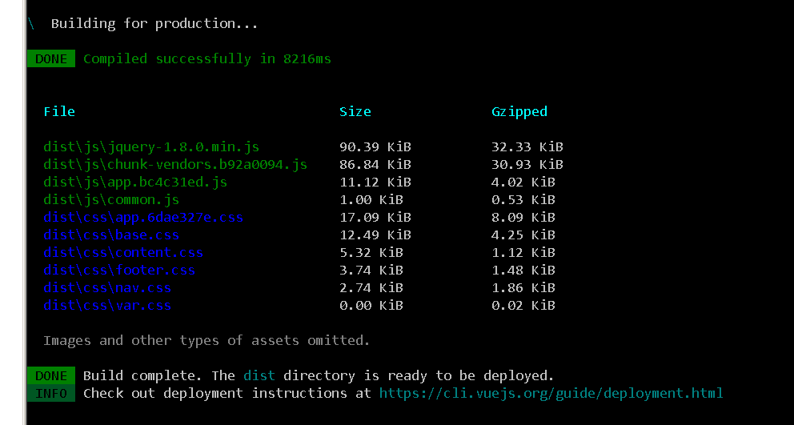

+ 打包后可将目录中的静态资源存放于任意服务器目录下进行运行，**但如果未进行开发和生产环境地址区分，会造成资源访问失败的情况**
+ 通过配置和修改 `vue.config.js` 配置文件可以进行生产环境和开发环境调整

```js
module.exports = {
    // publicPath:"/film-project/",
    // 根据开发环境切换项目目录
    // publicPath:process.env.NODE_ENV==="development"?"/":"/film-project/",
    // publicPath:process.env.NODE_ENV==="development"?"/":"./",
    publicPath:"./",
    // 不影响开发环境下的 调试功能，只会在程序打包时不去打包msp文件，让打包的JS文件无法调试
    productionSourceMap:false,
    // 开启开发环境下css的调试功能，不影响程序打包操作
    css:{
        sourceMap:true
    },
    pluginOptions: {
        'style-resources-loader': {
            preProcessor: 'less',
            patterns: ["./src/less/var.less"]
        }
    }
}
```

## 7、模块化项目的数据交互

+ 模块化项目多数基于SPA+MVVM设计模式构成，因此数据交互被限制为AJAX技术上

+ Vue模块化项目数据交互，同样基于异步请求模块完成

+ 因为MVVM设计模式**不再需要额外的DOM操作功能，因此对于ajax请求开始面向于专门完 异步请求的插件**

+ 可用于模块化的异步请求模块很多，官方推荐的使用 `axios` 模块

  + axios 插件是标准的基于 ==ES6 promise== 对象封装的，能够配合后端实现 RESFULL请求的 ajax 独立插件

    - 独立插件：任何场景任何页面均可使用的插件
    - RESFULL 请求：根据用户行为区分请求功能
      - GET == 描述当前请求完成的是数据查找
      - POST == 描述当前请求完成是数据添加
      - PUT == 描述当前请求完成原始数据的更新
      - DELETE == 描述当前请求完成 数据的 删除

    ```
    例子
    	后端提供一个接口   
    			http：//127.0.0.1:8080/product  ==>  该请求可以完成数据查找 添加 修改 删除
      后端根据请求类型，判断需要执行的方法
        	get  =>  执行的是查询操作
    		post =>  执行的添加操作
    		put  =>  执行的是修改操作
    		delelet  =>  执行删除操作
    ```

### 7.1、axios安装集成

- 通过npm 进行模块安装**`npm install axios --save `** , **`npm install axios -S `** 

+ 在项目需要使用的位置，通过ES6 的模块导入语法` import……from……`进行模块加载

+ 该模块加载完成后，提供异步请求对象 `axios`，该对象包含相关的请求方法

  + get 类型请求

  ```
  - axios.get(url[, config])
  - axios.delete(url[, config])
  - axios.head(url[, config])
  - axios.options(url[, config])
  ```

  - post 类型请求

  ```
  - axios.post(url[, data[, config]])
  - axios.put(url[, data[, config]])
  - axios.patch(url[, data[, config]])
  ```

### 7.2、axios的基本使用

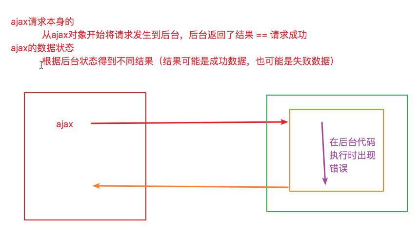

#### 1、get类型请求

```vue
<script>
// axios 的模块加载
import axios from 'axios';
// console.log(axios); // 加载的是一个可以用于全请求的ajax方法
// console.log(axios.prototype)

export default {
    data() {
        return {
            result:[],
            num:"1"
        };
    },
    methods:{
        sendGet1(){
            // 发生请求
            // 2、在异步请求方法中通过 axios 构成方法，调用对应的异步请求方法
            // axios.get(url[, config])
            //      url 定义请求地址的
            //      config 定义请求的配置
            //          - params 为URL定义请求参数，取值为对象，
            //                  其中对象的key为参数名称，对象的value为参数值
            //                  被定义在params中的参数，在请求发生时会直接转为对于的结果
            // axios的所有异步请求方法 都默认存在一个返回值，该值为 promise 构成对象
            // 基于 promise 对象的基础语法，完成后续数据处理操作
            // let p = axios.get("http://127.0.0.1/filmApi/loadTyps.php");
            // console.log(p);
            
            // axios 的请求结果会根据成功和失败分别返回两种数据
            //      1、请求成功，会返回一个response 对象
            //            该对象描述当前请求相关关键参数对象，该对象包含发生请求的时间，地址，状态，配置，响应结果……
            //      2、请求失败，会返回一个error对象
            // p.then(function(response){},function(error){});
            // p.then(function(response){
            //     console.log(response.data);
            // },function(error){
            //     console.log(error);
            //     alert("请求失败")
            // });
            
            axios.get("http://127.0.0.1/filmApi/loadTyps.php")
                .then((res)=>{
                    // console.log(res);
                    if(res.statusText=="OK"&&res.data.resultState){
                        this.result = res.data;
                    }else{
                        // Promise.resolve
                        // Promise.reject
                        return Promise.reject("参数");
                    }
                })
                .catch((error)=>{
                    // console.log(error)
                    alert("程序错误，请联系管理员")
                })
        },
        sendGet2(){
            // 直接使用 get 参数定义HTTP 请求地址之后
            // axios.get("http://127.0.0.1/filmApi/loadFilms.php?typeId=10001&size=2")
            axios.get("http://127.0.0.1/filmApi/loadFilms.php",{
                params:{
                    typeId:"10001",
                    size:this.num
                }
            })
            .then(( { statusText,data } )=>{
                if(statusText=="OK"&&data.resultState){
                    this.result = data.result;
                }
            })
            .catch(()=>{
                alert("程序错误，请联系管理员")
            })
        }
    }
};
</script>
```

#### 2、post类型请求

```vue
<script>
import axios from 'axios';
// axios 安装的同时默认携带一个模块 qs , 该qs 模式 可以实现url参数和JS对象的相互转换
import QS from 'qs';
// window.QS = QS;
export default {
    data() {
        return {
            size:2,
            typeId:10002
        };
    },
    methods:{
        sendPost(){
            // axios.post(url [, data [, config] ] )
            //     url 定义请求地址 
            //     data 是配置项 config 中 data和transformRequest 的整个参数定义
            //          根据参数类型进行请求区分
            //          string 表示请求只有 基本参数无文件上传，字符串格式必须使用 key=value&key=value…… 方式定义
            //          Object 表示请求包含文件上传，需要使用 formData对象进行定义
            //     config 定义依赖于 data的 定义
            //          params 用于定义 get 请求参数
            //          data 用于定义 post 请求参数 必须配合 transformRequest 进行请求前的参数处理
            axios.post("http://127.0.0.1/filmApi/loadFilms.php")
                 .then((response)=>{
                     console.log(response);
                 })
                 .catch((error)=>{
                     console.log(error);
                 })
        },
        sendPost1(){

            let formData = new FormData();
            formData.append("size",this.size);
            formData.append("typeId",this.typeId);

            // axios.post("http://127.0.0.1/filmApi/loadFilms.php",null,{
            //     data:{
            //         size:2,
            //         typeId:10002
            //     },
            //     // data:"size=2",
            //     // 在请求发送前对请求进行处理的函数
            //     transformRequest(data,headers){
            //         // console.log(data,headers);
            //         let formData = new FormData(); // JS 中专门用于ajax请求时的对象构建器
            //         for (const key in data) {
            //             formData.append(key,data[key]);
            //         }
            //         return formData;
            //     }
            // })
            // axios.post("http://127.0.0.1/filmApi/loadFilms.php","size=2&typeId=10002")
            // axios.post("http://127.0.0.1/filmApi/loadFilms.php","size="+this.size+"&typeId="+this.typeId)
            // axios.post("http://127.0.0.1/filmApi/loadFilms.php",formData)
            axios.post("http://127.0.0.1/filmApi/loadFilms.php",QS.stringify({
                size:2,
                typeId:10002
            }))
            .then((response)=>{
                console.log(response);
            })
            .catch((error)=>{
                console.log(error);
            })
        }
    }
};
</script>
```

### 7.3、跨域请求的分类和处理方式

#### 1、线上跨域（生产环境跨域）

- 前后端代码已经部署商用：项目完成开发，已经交付使用，所有的代码运行与真实的商用服务器上
  - **后端处理：代码上增加跨域请求头 == Access-Control-Allow-Origin**
  - **前端后端配置处理： 采用 JSONP 模式，前端完成JSONP请求发送（callback）**
  - **ngix : 代理服务器跨域**

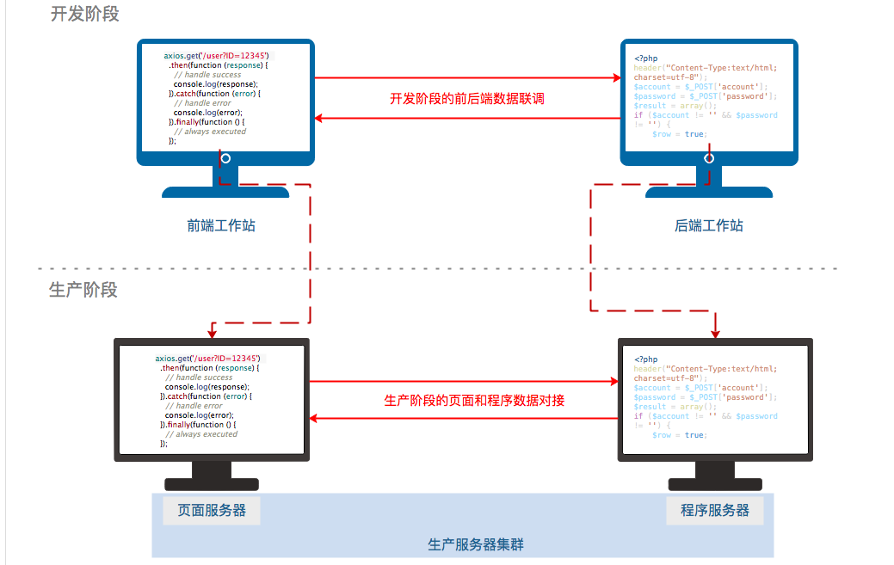

#### 2、开发跨域（开发环境跨域）

- **项目处于开发阶段：（完成前后端数据联调对接），但上线后跨域消失**
- 纯前端处理：由前端构建代理服务器完成跨域 （代理服务器:请求转发器）

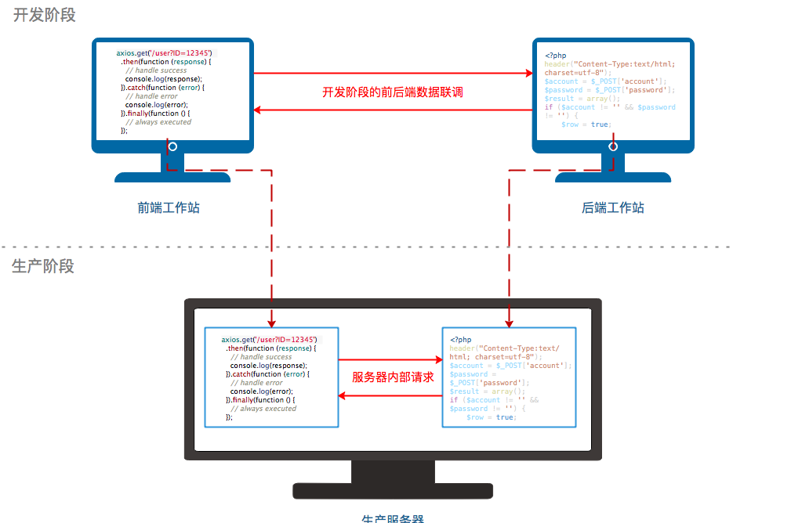


#### 3、vue模块化项目开发跨域的代理服务器配置

- **通过修改 vue.config.js 文件完成环境配置，环境配置需要重启开发服务器生效配置 **
- **代理服务器属于隐式代码执行，无法被浏览器进行监视和调测，可通过配置开启debug功能，在控制记录代理日志  **
- vue.config.js 配置项中devServer中存在`proxy` 开发服务器配置选项

```js
    // 配置开发服务器功能
    devServer:{
        port:"8080",
        // 代理服务器配置项 - 就是完成HTTP-PROXY模块的功能配置
        proxy:{
            // key : 定义项目中需要被代理服务拦截的请求前缀名称
            // value : 描述定义的请求前缀的请求，被拦截后的处理方式
            "/api":{
                /*
                    请求地址 /api/filmApi/loadTyps.php 通过代理转发
                    会在请求地址前补充 target 值
                    => http://localhost:80/api/filmApi/loadTyps.php
                */
                target:"http://localhost:80", //描述被拦截的请求需要转发到那个服务器上
                // 重写请求地址 - 重写的是请求的拦截前缀
                pathRewrite:{
                    // key 以正则表达时方式描述的需要被重写的 地址
                    /*
                        重写规则 在地址发送之前执行
                        请求地址 /api/filmApi/loadTyps.php 通过代理转发
                        * 地址重写 = /filmApi/loadTyps.php
                        会在请求地址前补充 target 值
                        => http://localhost:80/filmApi/loadTyps.php
                    */
                    "^/api":""
                },
                // 在服务器启动控制台，记录下程序运行过程中的所有拦截请求的处理方式
                logLevel:"debug"

            },
            // "/test":{
            //
            // }
        }
    },
```

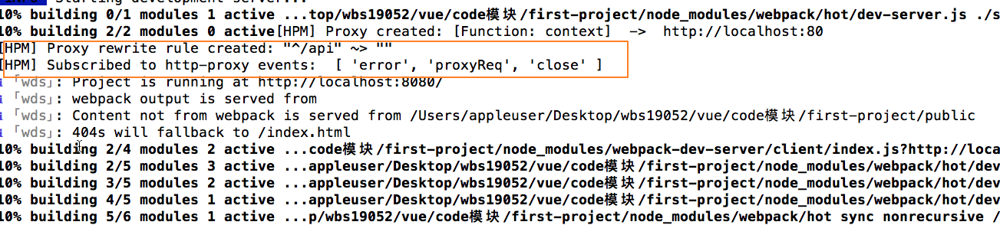


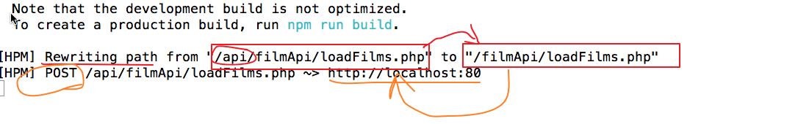

+ 生产环境和开发环境切换时的地址动态切换

  - 通过vue提供环境监测 **`process.env.NODE_ENV`**进行环境判断 

    ```js
    let baseUrl = process.env.NODE_ENV==="production"?"生产环境地址":"开发环境地址";
    ```

### 7.4、AJAX请求的API模块化

- 请求方法的复用
- 请求地址的统一管理
- 请求数据的统一处理
- 请求的权限统一处理
- 所谓的功能模块化实际上就是**将功能进行JS文件单独定义**，然后以模块方式进行加载调用

## 8、路由 （vue-router）

- vue全家桶构成：vue + vue-router + vuex (**不在简历上写vue全家桶**)
- 在页面中提供操作接口，让用户可以通过简单操作方式，完成组件的切换展示
- 路由是一种组件动态化分发机制，通过**模拟 URL** 路径变换 ，寻找对应的组件并将组件渲染页面显示到对应的位置

### 8.1、添加路由模块

#### 1、自动化安装

- 在创建项目时 `vue create 项目名称`通过选择路由功能自动添加
- vue/cli 3.0 版本中对以创建的项目，通过下述方式进行自动添加
  - 1、通过命令 `vue add router` 进行插件安装的同时配置路由功能
  - 2、启动 GUI 页面 `vue ui` 通过添加路由按钮进行自动换添加

**上述的两种按照，都会导致项目文件被覆盖 = App.vue main.js HelloWord.vue**

#### 2、手动安装路由

- **路由功能依赖于模块 vue-router , 安装路由插件 `npm install vue-router -S`**
- 配置项目路由功能
  1. 在当前项目的src 目录下创建 route.js 文件
  2. 在main.js 文件中导入并装载路由功能

### 8.2、路由配置和使用

#### 1、基本配置和使用

+ 路由模块在Vue原型配置增加了一个新的配置 `router` 接收一个 `VueRouter`对象，用于记录路由表

+ 路由功能通过`new VueRouter(options)` 配置完成定义

  ```js
  
  options={
    // 激活路由样式配置
    linkActiveClass:"class名称",
    linkExactActiveClass:"class名称",
    // 路由模式切换
    mode:"history|hash",
    // 描述组件和地址的关系 ==> 当URL地址变换后，vue知道该地址应该渲染那个组件 
  	// 路由中定义的组件 以及被路由进行统一管理，不需要在使用页面中定义为局部组件
    routes:[
      { 
        path:"定义组件地址"，
        name:"路由别名"
        component："定义组件",
        redirect："目标地址",
        meta:"定义自定义数据",
        children:"定义子路由"
      }
    ]
  }
  
  ```

+ **Vue.use(VueRouter)**提供两个用于路由显示和切换的全局组件

  1.   `<router-view></router-view>` 提供页面组件占位符号
  2.  `<router-link></router-link>`  用于切换和跳转组件

#### 2、地址定义

+ 基本地址定义
  + 通过配置path属性描述组件和地址关系，一级路由定义时必须使用`/`开头，子级路由可选择绝对路径或相对路径
+ 默认地址定义
  + **vue路由默认展示地址为 `/` 的组件，**因此以`path:"/"`描述默认组件
  + 默认地址一般使用路由定向方式跳转到其它组件上：`{path:"/"，redirect："目标地址"}`

+ 通配地址定义
  + **对没有在路由表中定义的路径，vue会进行统一的地址处理**
  + 通过配置**path通配符 `*`**，描述路由表中不存在的地址默认访问的组件
    + `{path:"*"，redirect："目标地址"}` 
    +  `{path:"*"，component：组件}`

#### 3、路由模式切换和定义

+ 通过配置 mode 取值，可修改路由模式
  + hash模式 ： 以 html 中 锚点技术实现的 路由匹配切换
    - 锚点 可以更改 url地址的同时 ，不刷新页面的方式实现
    - 通过 window.location.hash 获取 锚点值，通过锚点值 匹配组件，进行渲染展示
  + history 模式 ： 历史地址模式
    - 该模式不能单独使用，必须需要后台通过代码进行 配合使用
    - 将地址转换为正常的 URL地址，**通过后端代码的拦截处理时实现页面不刷新组件更新的效果**

    > history 模式从常规意义而言，还是地址变更，可能导致项目无法访问的请求出现；
    >
    > history模式必须由前端和后端统一进行定义描述的
    >
    > [后端配合方式](<https://router.vuejs.org/zh/guide/essentials/history-mode.html#%E5%90%8E%E7%AB%AF%E9%85%8D%E7%BD%AE%E4%BE%8B%E5%AD%90>)

### 8.3、激活路由的控制

- 激活路由：当前URL地址展示的组件 对应的路由配置 叫做激活路由

#### 1、激活路由样式控制

- **Vue.use(VueRouter)**提供两个用于描述激活路由样式的class样式名
  - `.router-link-active` 样式
    - 该样式被自动定义在`<router-link>`标签上
    -  样式随着激活路由的变化，选择出现在**路径中包含当前路径**的`<router-link>`标签上
  - `.router-link-exact-active` 样式 
    - 该样式被自动定义在`<router-link>`标签上
    - 样式随着激活路由的变化，选择出现在**路径完全相同**的`<router-link>`标签上

#### 2、激活路由信息对象

- **Vue.use(VueRouter)**提供组件全局数据仓库 `$route`

  - 路由模块通过对 Vue 原型的修改，为 ==所有的 vue实例的数据仓库 增加一个 特殊变量 `$route`,==

  - `$route`是激活路由信息==对象==，存储当前激活路由的相关信息

  - `$route`为组件共享数据仓库，==所有组件的$route 都是同一个对象==

  - `$route`为只读对象，无法被修改

    ```js
    {
      	path:"/detail"   // 描述当前激活路由的 路径地址
        query:Object (empty)   //  存放是当前激活路由  get 形式传递的参数
        params:Object (empty)  //  存放是当前激活路由  rest 形式传递的参数
        fullPath:"/detail"   // 路由地址和参数地址形成的完整路径
        meta:Object (empty)  //  激活路由的原始信息
    }
    ```

#### 3、激活路由原信息

- meta 属性在构建路由时 ，为当前路由定义的 自定义配置项，**用于页面特殊构成的配置**
- 完成页面访问的权限操作

### 8.4、路由切换传参

- 路由参数常用与对相同组件传入不同数据，实现组件页面展示切换，根据不同的参数加载不同的展示数据
- 注意事项：
  - **1、路由参数不要过长或过多**
  - **2、路由参数传递关键参数，用于后台数据查询**

#### 1、get方式参数

- 以 HTTP get请求传递参数的方式，将参数传递下一个组件上

  - get 方式传递参数，在页面特定路径情况下，不会刷新页面
  - 在vue的路由构成中，get参数虽然会导致路径变化，但不会影响路径对组件指定

- 1、在页面中对路由的跳转地址 **以 ？和 & 方式定义动态参数**

- 2、在目标组件中以激活路由对象 **`$route`** 进行参数的获取

  ```js
  vm.$route.query
  vm.$route.query.参数名
  ```

#### 2、rest方式

- Resfull 风格请求出现后，提出一种新的基于URL地址栏 参数传递方式
  1. 参数本身还是存在于 URL地址栏上
  2. 通过伪装URL地址伪装，实现隐藏参数

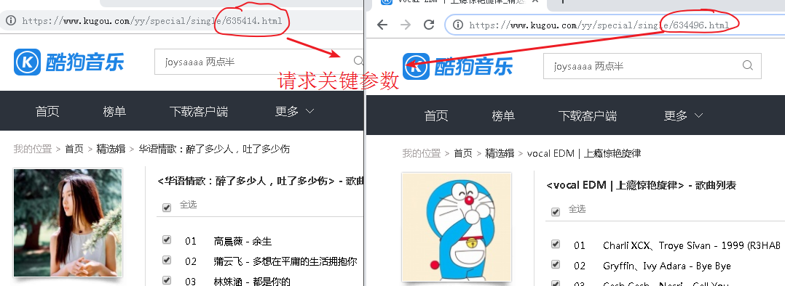

- rest就是将参数伪装成请求地址的一部分进行URL的模拟操作
- **vue路由项目中，如果需要实现 rest 参数传递，需要配合路由的相关配置**

**实现方式**

- 1、在页面定义请求路径时，以 URL的地址定义规范拼接参数的**值**

  ```
  请求地址  /detail   
  携带参数  filmId=234567   
  				 aa=1234
  
      get：  /detail?filmId=234567&aa=1234
      rest:  /detail/234567/1234  或 234567/detail/1234 或 1234/detail/234567  ……
  ```

- 2、在vue的路由定义中，需要在path属性构建时，明确表示地址存在几个部分且那些部分为参数

  - 路由地址配置属性 `path` ，可借助关键字 `:` 描述地址那些部分为参数

  - `:`后所定义的名称，将成为该参数的变量名

    ```js
    { path:"/detail/:filmId/:aa" }
    ```

  - rest风格参数定义后，可通过 `?` 描述该参数是否为可选参数

    ```js
    { path:"/detail/:filmId?/:aa?"},
    ```

- 3、在目标组件中以激活路由对象 **`$route`** 进行参数的获取

  - 配置路由path时，`:`后定义的变量名，将作为参数名写入 `params`对象中，用于指代参数

  ```js
  vm.$route.params
  vm.$route.params.参数名
  ```

#### 3、router-link的to属性定义

- to 作用是用于完成组件切换指向，定义携带参数
- 当to属性以 v-bind 方式进行数据绑定时，可用于拆分地址和参数
  - 取值string 类型 ：
    - get : 传统的 string路径定义方式 **to="路径?参数名=参数值&参数名=参数值……"**
    - rest : **to=" ……路径/参数值/参数值…… "**
  - 取值object类型 ：以对象方式拆分 路径的 组件地址 和 参数
    - get ：**to=" { path:'组件的路径地址'， query:{ key:value,key:value } } "**
    - get ：**to=" { name:'组件的路径地址'， query:{ key:value,key:value } } "**
    - rest ：**to=" { name:'路由组件的别名'， params:{ key:value,key:value } } "**
      - ==rest方式必须使用具名路由传递参数==
      - **此时路由切换将不受 path 属性的影响，只要保证 name 属性的值不变即可**
- **具名路由对于参数的影响**
  - 因具名路由不受path属性的影响，因此在切换时会导致路径的特殊变化

### 8.5、编程式导航

- 通过JS代码控制路由切换，统称为编程式导航
- **Vue.use(VueRouter)**提供组件全局实例属性 `$router`
  - $router 对象中，存放编程式导航的执行方法，因此该对象被称为 路由控制对象
- $router 的常用方法
  - $router.push(`location`) 跳转到指定页面
    - location 参数 以string 方式定义跳转目标组件的地址和参数
    - location 参数 以object 方式定义跳转目标组件的地址和参数
  - $router.go(n) 模拟浏览器的 前进按钮
  - $router.back() 模拟浏览器的 后退按钮

### 8.6、路由缓存

+ Vue为了优化组件在浏览器中使用率和内存占用量上，做了路由组件的 ==缓存操作==
  - 如果发现跳转的地址指向的组件 ，为当前激活路由组件 （**组件相同**），vue将不再对当前组件进行重新渲染和绑定
  - 因为组件缓存导致组件不重新渲染，因此组件mounted钩子函数之前的生命周期将不再被执行

## 9、全局功能定义

- 用于统一定义和设置全局方法，全局属性，全局过滤器，全局指令，全局组件 ……

- 构成方法依赖于插件安装方法 **Vue.use()** , 该方式将装载功能作为当模块安装至Vue全局功能上

  - `Vue.use()` 方法一般被定义在 main.js 文件中

  - `Vue.use(options)` 为一个固定构建对象

    ```json
    {
      install:function(Vue){
        
      }
    }
    ```


