# Vue基础篇

***陈华旺-chenhuawang@itany.com***

[TOC]

> JS库：对JS中相关功能进行封装后的独立JS文件，页面进行文件加载后，可以使用文件提供封装功能
>
> JS框架：对JS中相关操作的功能以封装方式完成新语法的定义，实现一个整合功能操作方式

## 1、设计模式

### 1.1、SPA 

- SPA：single page application  单页应用程序
  - SPA应用将所有的活动局限于一个 Web 页面中，仅在该 Web 页面初始化时加载相应的 HTML 、js 、CSS 
  - SPA应用一旦页面加载完成， SPA 不会因为用户的操作而进行页面的重新加载或跳转
  - SPA应用利用 JavaScript 动态的变换 HTML，从而实现UI与用户的交互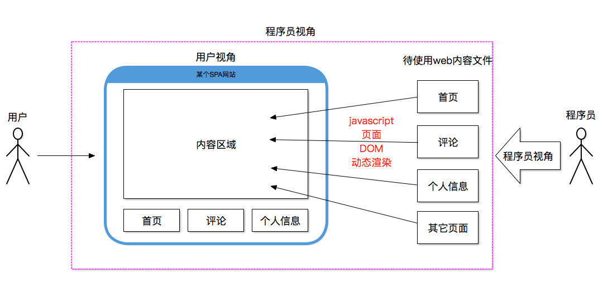

### 1.2、MVVM 

- mvvm：model-view -viewModel  模型 视图 视图数据模型
  - 模型：指的是构成页面内容的相关数据（包含：前端定义的数据，后端传递的数据）
  - 视图：指的是呈现给开发这和用户查看的展示数据的页面
  - 视图数据模型：mvvm设计模式的核心思想，它是连接view和model的桥梁。

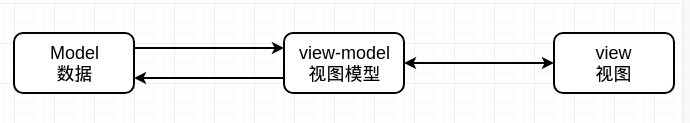


> Tips：前端实现MVVM设计思想的框架（Vue,React,Angular,微信小程序……），其目的都是为了高度封装view-model 的交互过程，让开发这只用关心页面构成和数据构成，无需花费大量时间关心数据和页面的状态关系

## 2、Vue简介

+ Vue (读音 /vjuː/，类似于 **view**) 是一套用于构建用户界面的**渐进式框架**
+ Vue 的核心库只关注视图层，不仅易于上手，还便于与第三方库或既有项目整合
  + 渐进式框架：根据项目需求选择性增加扩展功能，完成项目结构
+ Vue借鉴React和Angular的部分代码设计，并提高了易用性和轻量化

## 3、Vue的页面基本使用

- 获取vue的核心语法库

  - 通过地址 <https://cdn.jsdelivr.net/npm/vue/dist/vue.js> 下载vue核心语法包
  - 使用  npm 进行Vue语法库的下载 
    - `npm install vue`

- 页面在Vue库

  ```html
  <script src="../js/vue.js"></script>
  ```

  - 页面装载Vue核心语法后，会在浏览器window对象中提供一个全局的构造方法**Vue**
  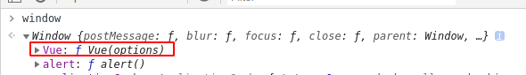
  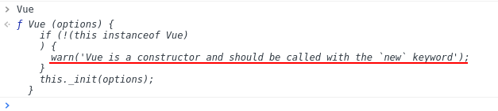
  - **Vue函数为一个JS对象构造器，使用时需要通过 new 关键字进行 Vue 对象创建**

- 页面基本关联和应用

```html
<!DOCTYPE html>
<html lang="en">
<head>
    <meta charset="UTF-8">
    <meta name="viewport" content="width=device-width, initial-scale=1.0">
    <meta http-equiv="X-UA-Compatible" content="ie=edge">
    <title>Document</title>
    <!-- 
        在HTML页面中直接通过 script 标签加载 vue的核心语法文件
        核心语法文件会为整个项目的运行环境（浏览器提供的window对象）
        vue核心语法库，会在环境中添加一个全局变量 ,变量名称 Vue
        提供的Vue为使用 Vue框架的关键变量
     -->
     <!-- 
        JS的对象创建方式
        1、字面量方式
        var user = { 对象属性：值 }
        2、构造函数方式
        function User(){
            this.属性 = 属性值；
        }
        var u = new User();
      -->
      <!-- 
          开发的语法习惯
            js 程序员在项目开发时的一种自我限制要用
            1、方法是构造方法 ，首字母大写，且遵循驼峰命名法
            2、在对象中属性名称以 _ 开头的 为私有属性，该属性不能在对象外部调用
            3、如果方法参数形参名称为 options ,说明该参数为 Object 类型
       -->
    <script src="./js/vue.js"></script>
    <script>
        window.onload = function(){
            // 1、通过关键字 new 创建一个 Vue的 实例 对象
            //   vue 的后续 页面和数据的开发，都将基于这个实例对象
            // new Vue(options);
            //      options 取值 为一个 对象数据
            //      vue的基础语法学习，就是在学习该对象怎么配置以及使用方式
            // var obj = { };
            // new Vue(obj);
            new Vue({
                // key:value,key:value……
                // 2、将vue实例 和 页面的某个的元素产生关联
                // el:string - 定义元素的 选择器
                //      el 属性的作用：描述当前vue实例和那个页面元素有关系
                //      限制vue的语法使用范围 = 被 el 描述的元素内部 是当前 vue实例的语法实现区域
                //      独立实例的页面关系 = 每个实例关联的页面元素 不会出现重复
                // el的特性 取值为元素选择器
                //         el 只会在页面中选择第一个匹配上的元素
                // el指定的DOM元素的要求
                //        1、元素必须是非 HTML HEAD（包含head中的定义标签） BOODY 标签
                // element select
                el:"#app",
                // data 属性用于描述 vue 环境中 为试图提供数据支持的 数据模型
                //   vue的数据仓库 之一
                data:{
                    msg:"aaaa"
                }
            });
            // new Vue({
            //     el:".aaa",
            //     data:{
            //         msg:"bbb"
            //     }
            // })
        } 
    </script>
</head>
<body>
    <div id="app">
        <p>{{ msg }}</p>
        <input type="text" v-model="msg">
    </div>
    <hr>
    <!-- <div class="aaa" id="app">
        <p>{{ msg }}</p>
        <input type="text" v-model="msg">
    </div> -->
</body>
</html>
```

+ Vue官方开发调试工具 `vue devtools`：工具在开发环境下可以实现浏览器对vue功能的基本监控


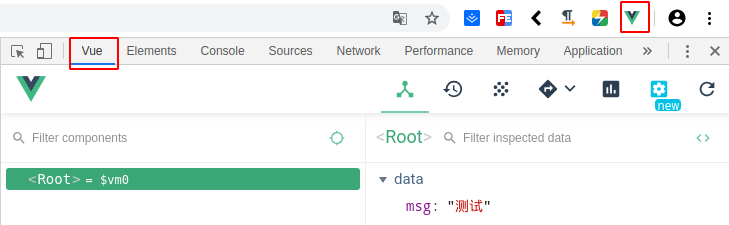

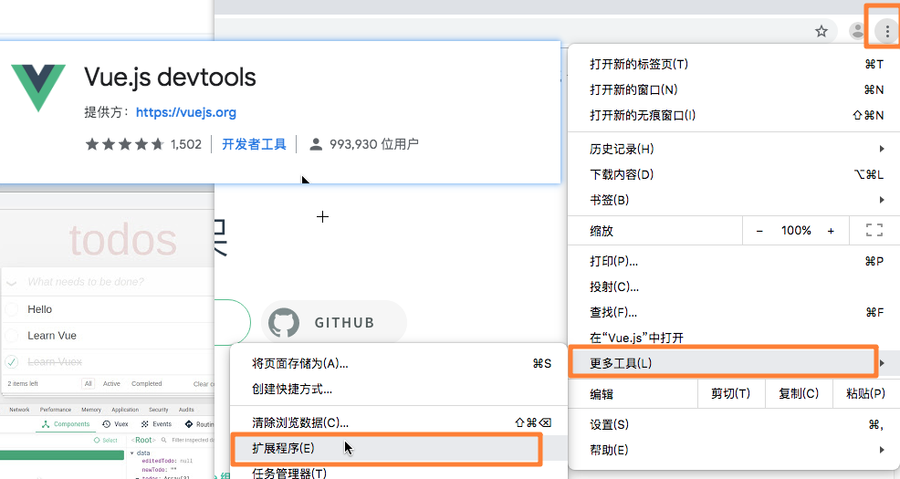

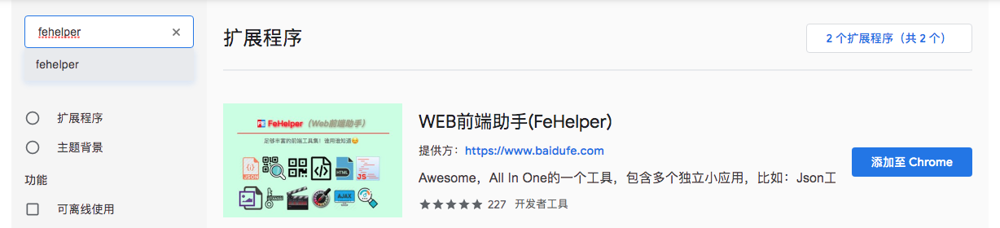

+ vscode 的插件安装

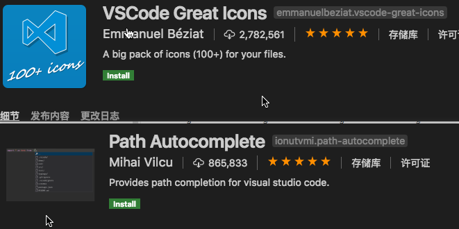

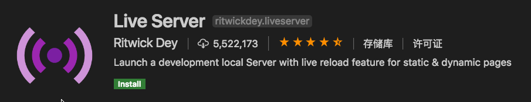

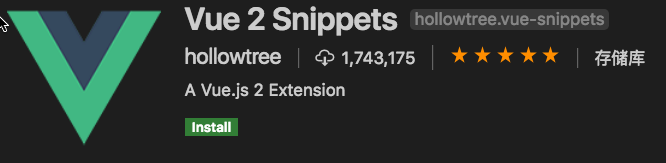

## 4、Vue的全局环境配置

+ 在vue项目运行启动前，对vue的运行环境进行相关功能设置
  + 开启关闭调试工具，关闭开启控制台日志和警告，关闭开启调试工具……
  + 所有的Vue全局环境设置依赖于Vue的全局配置对象**`Vue.config`**

```js
// 取消 Vue 所有的日志与警告 , 取值类型：boolean 默认值：false
Vue.config.silent = true; 

//配置是否允许 vue-devtools 检查代码 , 取值类型：boolean
//开发版本默认为 true，生产版本默认为 false。生产版本设为 true 可以启用检查。
Vue.config.devtools = true

// 设置为 false 以阻止 vue 在启动时生成生产提示 , 取值类型：boolean 默认值：true
Vue.config.productionTip = false;
```

## 5、基本交互

### 5.1、插值表达式

+ 语法：`Mustache语法`  `{{  }}`

+ 功能：取决于JS框架为其赋予的 功能特性 == **在不同的框架下 语法功能能不同**

+ **特性：响应式数据功能：**

  + HTML标签通过插值表达式绑定Vue的数据变量，当变量发生变化时该标签会重新渲染加载。
  + 插值表达式只能对 Vue 数据变量变化作为响应，而无法修改变量

+ 对于Vue框架而言：只能被用于 html 标签的主体内容中，不能用于标签的其它位置

+ 对于Vue框架而言：只能绑定对应 Vue对象数据仓库中定义的变量，或者 **简单的 JS 表达式** 和 **JS 内置对象**

  ```html
  <标签>{{ Vue对象数据仓库变量|JS表达式|JS内置对象|JS的匿名变量 }}</标签>
  ```

  > Tips:当Vue数据仓库中变量名称和JS内置对象名称相同时，Vue将优先使用仓库中变量

+ 对于不同类型的数据 ，为保证页面输出正确结果，vue插值表达式 对所有 变量调用了自定义的**toString()**方法

  ```js
  var _toString = Object.prototype.toString;
  
  // 判断对象 一定是 自定义的 简单对象，而非JS中的特殊对象(例如 new Date())
  function isPlainObject (obj) {
      return _toString.call(obj) === '[object Object]'
  }
  
  // vue定义的toString 方法，作用在插值表达式取值时进行类型转换
  function toString (val) {
  		//val 形参就是 插值表达式调用时定义的 变量
    
    	// 判断 传入的 val 值是否为 null 或者 undefined 时 直接返回 '' (空字符串)
      return val == null?'': 
      	// val 不是 null 或者 undefined
      	//    如果 val 是 数组 执行 JSON.stringify()
      	//    若干 val 是开发者自定义 简单对象，会调用 JSON.stringify()
      	Array.isArray(val) || (isPlainObject(val) && val.toString === _toString)?
        	JSON.stringify(val, null, 2)
      		: String(val)
  }
  ```

+ 值表达式 底层调用的 是 DOM 对象的  textContent 属性 进行值得写入操作

  - **html格式字符串将不被解析**
  - js 转义符将不被识别

```html
<!DOCTYPE html>
<html lang="en">
<head>
    <meta charset="UTF-8">
    <meta name="viewport" content="width=device-width, initial-scale=1.0">
    <meta http-equiv="X-UA-Compatible" content="ie=edge">
    <title>Document</title>
    <script src="./js/vue.js"></script>
    <style>
        .p{
            height: 40px;
            border: 1px solid black;
        }
    </style>
    <script>
        function setInnerText(pDom){
            /*
                js环境下，DOM元素的 innerText 取值只能为string值
                js 在完成 DOM的innerText 属性赋值时，会将值转为 string类型
                  js 通过调用 原型上 toString() 方法或者完成 String()强制类型转换
                  将变量转为string类型
                对于数组变量 调用是 Array 重写的toString()
                null|undefined 转换为 string 执行强制类型转换 String(null|undefined)
                  JS 对于 DOM 的 innerText 属性的操作 会判断值为null 时输出“”
            */
            // pDom.innerText = "字符串";
            // pDom.innerText = 123;
            // pDom.innerText = true;
            // pDom.innerText = [1,2,3,3,4]
            // pDom.innerText = {
            //     name:"tom"
            // }
            // pDom.innerText = null;
            // pDom.innerText = undefined;

            // DOM 元素上 属性 textContent 和 innerText 属性功能基本一致
            //      唯一的区别 在于对JS中 转义符号 \n 的转换方式
            //      innerText 会将换行符转为 <br> 标签
            //      textContent 不会转换 换行符号 （HTML会将换行识别为 一个空格）
            // pDom.innerText = "aaaaa\nbbbbbbb";
            pDom.textContent = "aaaaa\nbbbbbbb";
        }
    </script>
</head>
<body>
    <pre>
        HTML 页面可以展示的数据
    </pre>
    <p class="p" onclick="setInnerText(this)"></p>
    <hr>
    <div id="app">
        <pre>
            插值表达式在vue框架中，主要完成将实例数据仓库中的变量写入到页面中
            + 如果页面插值表达式定义的变量并不存在：
                - vue提示（错误提示） "info" is not defined  某个方法某个变量未定义
            + 如果定义的变量为 数组 或 对象，页面中想要获取数组和对象中的相关值
                - vue语法中 插值表达式可以完全支持 JS 的 变量调用语法
            + vue 在执行 插值表达式功能是，会将非字符串数据转换为 string 类型
                - vue 的插值表达式调用 自定义的toString 方法
                - vue 项目向标签进行内容写入时，调用的时DOM元素 textContent 属性
        </pre>
        <p>{{ msg }}</p>
        <!-- <p>{{ info }}</p> -->
        <p>arr[0]:{{ arr[0] }}</p>
        <p>user.name:{{ user.name }}</p>
        <p>user['name']:{{ user['name'] }}</p>
        <hr>
        <p>字符串类型：{{ msg }}</p>
        <p>数值类型：{{ num }}</p>
        <p>布尔类型:{{ flag }}</p>
        <p>数组类型：{{ arr }}</p>
        <p>对象类型：{{ user }}</p>
        <p>null:{{ arg1 }}</p>
        <p>undefined:{{ arg2 }}</p>
        <p>时间对象：{{ day }}</p>
        <p>带换行符号的字符串：{{ str1 }}</p>
        <p>带标签的字符串：{{ str2 }}</p>
        <hr>
        <p name="{{ msg }}">为属性绑定</p>
    </div>
    <script>
        new Vue({
            el:"#app",
            data:{
                msg:"字符串",
                num:123,
                flag:true,
                arr:[1,2,3,4],
                user:{
                    name:"tom",
                    age:23
                },
                arg1:null,
                arg2:undefined,
                day:new Date(),
                str1:"aaaa\nbbbbb",
                str2:"<p>测试</p>"
            }
        })
    </script>
</body>
</html>
```

```html
<!DOCTYPE html>
<html lang="en">
<head>
    <meta charset="UTF-8">
    <meta name="viewport" content="width=device-width, initial-scale=1.0">
    <meta http-equiv="X-UA-Compatible" content="ie=edge">
    <title>Document</title>
    <script src="./js/vue.js"></script>
</head>
<body>
    <div id="app">
        <pre>
            1、JS表达式
                - 简单的JS可执行的逻辑代码
                - 四则运算 ，逻辑运算、比较运算、三目(元)运算
                - 简单运算一定具有返回结果
                
            2、JS内置对象
                - js环境可以直接作为变量提供使用的相关对象，例 Math 对象
                - 页面只能输出具有返回值得 内置对象方法
                - 如果是内置对象的方法调用，方法参数可以定义 vue实例的数据仓库变量
            
            3、JS的匿名变量：vue的插值表达式取值范围内，可以直接定义JS的无名称变量
                - 匿名变量在插值表达式中进行定义时 ，必须遵循JS变量定义规则
        </pre>
        <p>{{ 1234 }}</p>
        <p>{{ true }}</p>
        <p>null:{{ null }}</p>
        <p>{{ [1,2,3,4] }}</p>
        <p>{{ {name:"aaa"} }}</p>
        <p>{{ "字符串" }}</p>
        <!-- <p>{{ 字符串 }}</p> -->
        <hr>
        <p>内置对象的调用：{{ Math.PI }}</p>
        <p>Math.random():{{ Math.random() }}</p>
        <p>Math.floor(1.23456)：{{ Math.floor(1.23456) }}</p>
        <p>{{ Math.ceil(num) }}</p>
        <hr>
        <p>{{ 1+2 }}</p>
        <p>{{ true&&false }}</p>
        <p>{{ 1>10?"是":"否" }}</p>
    </div>
    <script>
        new Vue({
            el:"#app",
            data:{
                num:33.23456
            }
        })
    </script>
</body>
</html>
```

### 5.2、基础指令

- 为开发者 提供 在页面中进行 特殊功能的属性描述方法

  - 语法：Vue指令以 `v-名称` 结构定义
  - 位置：**指令只能被用于 html 容器的标签属性上**   `<标签 v-指令="" ></标签>`
  - 实现：指令本身实际上就是一个JS方法的特殊封装，页面定义的指令只是对方法的调用和触发
  - 功能：通过指令可实现 HTML标签写入，标签判断、标签循环、标签事件绑定、标签属性绑定……

- 完整语法：

  - `v-指令名[:参数][.修饰符][.修饰符]……[=取值]`

  - `v-指令名[:参数][.修饰符][.修饰符]……[="取值"]`

    - 指令参数：一般是对指令使用范围的限制
    - 指令修饰符：一般是对指令功能的限制
    
    > Tips：
    >
    > ​	1、普通指令取值范围和插值表达式基本一致，可取Vue数据仓库中定义的变量，可取匿名变量，可取JS内置对象、可进行简单的四则运算；
    >
    > ​	2、对于特殊指令`v-on`只能绑定Vue方法仓库中的自定义方法，或绑定简单JS表达式

- **指令特性：无痕迹特性==代码开发时标签上的vue语法表达式，在项目运行时会被删除，不会保留**

  > vue对象和容器完成语法解析后，不会在浏览器上保留语法定义规范

#### 1、v-text

- 取值：`string`
- 功能：更新元素的 `textContent`。如果要更新部分的 `textContent` ，需要使用 `{{ Mustache }}` 插值。
- 示例：`<span v-text="msg"></span>`

#### 2、v-html

- 取值：`string`
- 功能：更新元素的 `innerHTML` 
- 示例：`<div v-html="html"></div>`

#### 3、v-pre

- 取值：**不需要表达式**，该指令为boolean类型属性
  - 写表示 true（启用功能） 不写表示 false（不启用功能）
- 功能：跳过这个元素和它的子元素的编译过程。可以用来显示原始 Mustache 标签。跳过大量没有指令的节点会加快编译。
- 示例：`<span v-pre>{{ 该语法会直接显示在页面 }}</span>`

#### 4、v-once

- 取值：**不需要表达式**，该指令为boolean类型属性
  - 写表示 true（启用功能） 不写表示 false（不启用功能）
- 功能：对当前元素和内部元素vue功能执行**一次**，程序执行过程不在对该元素范围内的vue功能进行重新执行
- 示例：`<span v-once>该区域vue功能只在初始化时执行一次 {{msg}}</span>`

#### 5、v-cloak

- 取值：**不需要表达式**，该指令为boolean类型属性

- 功能：实现在vue功能构建完成前，隐藏浏览上vue语法表达式，**该指令本身不具有特殊功能，需配合css样式实现效果**

- 示例：

  ```css
  [v-cloak] {
    display: none;
  }
  ```

  ```html
  <div v-cloak>
    {{ message }}
  </div>
  ```

> Tips：v-cloak指令功能主要利用了 **指令特性** + css 样式实现，因此所有的vue指令都可以实现该功能

#### 6、v-on

- 缩写：`@` ，项目中可用 `@` 替代 `v-on:`

- 语法：

  ```html
  <button v-on[:参数][.修饰符]="取值"></button>
  <button @[:参数][.修饰符]="取值"></button>
  ```

> JS 的API 文档中，一但属性方法形参…… 以 [] 方式包裹，说明该参数是可传可不传

- 取值：`Function | Inline Statement | Object | Array`

- 参数：eventName（事件名称）

- 功能：绑定元素事件监听器，事件类型由参数指定

- v-on 绑定的事件必须是vue对象 **方法仓库** 中的一个自定义方法

  ```js
  new Vue({
      // 当前vue实例对应的方法仓库
      methods:{
  		
      }
  })
  ```

- **修饰符**：

  ==按键修饰符（键盘按键|鼠标按键）==

  - `.{keyCode | keyAlias}` - 只当事件是从特定按键触发时才触发回调。

    > vue1.0 版本 可以使用 keyCode | keyAlias
  >
    > vue2.0 版本 只能使用 keyCode，提供了一个全局配置可以完成自定义 keyAlias 
  >
    > ```js
  > Vue.config.keyCodes ={
    >  	描述文字：keyCode
  > }
    > ```
  >
    > vue2.3^ 版本  可以使用 keyCode | keyAlias

  - `.left` - (2.2.0) 只当点击鼠标左键时触发。(表示键盘方向 左键)

  - `.right` - (2.2.0) 只当点击鼠标右键时触发。(表示键盘方向 右键)

  - `.up` - 只当键盘方向上键被触发时

  - `.down` - 只当键盘方向下键被触发时。
  
  - `.middle` - (2.2.0) 只当点击鼠标中键时触发。（滚轮的点击）
  
  > 组和按键修饰符的关系
  >
  > ​       一个事件同时被多个按键进行和修饰定义，表示的时同时按下修饰的按键
  >
  > ​      ==>   ctrl shift alt 这些按键按下后，在按其它按键，可以产生上述组合效果
  >
  > ​      修饰中不包含状态按键，表示的 按键的或者关系，任意修饰按键触发，都会执行函数
  
  ==功能修饰符==
  
  - **`.native` - 监听组件根元素的原生事件。(组件开发有关)**
  
  - `.once` - 只触发一次回调:**事件执行一次后就会失效**。
  
  ==事件机制修饰符==
  
  - `.stop` - 调用 `event.stopPropagation()`。
  
  - `.prevent` - 调用 `event.preventDefault()`。
  
  - `.capture` - 添加事件侦听器时使用 capture 模式（事件捕获模式）
  
  - `.self` - 只当事件是从侦听器绑定的元素本身触发时才触发回调。
  
  - `.passive` - (2.3.0) 以 `{ passive: true }` 模式添加侦听器（启用默认事件功能）
  
    > Tips：addEventListener() 事件绑定中的 passive 属性和 preventDefault 功能的关系
    >
    > ​	元素事件每次被触发，浏览器都会去查询被执行行为是否有preventDefault阻止该次事件的默认动作。
    >
    > ​	加上**passive就是为了告诉浏览器，不用查询了，执行 方法中没用preventDefault阻止默认动作。**
    >
    > ​        这里一般用在滚动监听，@scoll，@touchmove 中。因为滚动监听过程中，移动每个像素都会产生一次事件，每次都使用都进行查询prevent会使滑动卡顿。通过passive将内核线程查询跳过，可以大大提升滑动的流畅度。
    >
    > **注：Vue事件绑定时，passive和prevent冲突，不能同时绑定在一个监听器上。**

#### 7、v-show

- 取值：`any`
- 功能：根据表达式的boolean结果，**切换元素的 `display` CSS 属性，控制元素显示隐藏**
- 示例：`<p v-show=" flag "></p>`

#### 8、v-if、v-else-if、v-else

- 取值：

  - v-if：`any`
  - v-else-if：`any`
  - v-else：**不需要表达式**，该指令为boolean类型属性

- 用法：根据表达式的boolean结果，**执行元素的创建和删除操作**

- 示例：

  ```html
  <div v-if="type === 'A'">A</div>
  <div v-else-if="type === 'B'">B</div>
  <div v-else>Not A/B/C</div>
  ```

  - `v-else` 指令的上一个元素 必须使用了 `v-if` 或者 `v-else-if`
  - `v-else-if` 指令的上一个元素 必须使用了 `v-if` 

#### 9、v-for

- 取值：`Array | Object | number | string `

- 功能：基于数据多次渲染元素或模板块

- 语法：`<标签 v-for=" 取值表达式 in 待循环值 "></标签>`

  - 取值表达式：可直接定义临时变量；

  ```html
  <div v-for="item in items">
    {{ item.text }}
  </div>
  ```

  + 取值表达式：也可以为数组索引指定别名 (或者用于对象的键)：

  ```html
  <div v-for="(item, index) in array"></div>
  <div v-for="(val, index) in string|number"></div>
  <div v-for="(val, key, count) in object"></div>
  ```

- **辅助渲染**：`v-for` 指令为提高性能采用部分标签渲染操作（**只针对与需要添加和删除的标签进行渲染操作**）

  - `v-for` 默认不改变整体，而是**重复替换使用已有元素**，该方式会导致页面排序功能展示出现问题。
  - 为迫使其`v-for`重新排序元素，需要提供一个 `key` 的特殊属性，为每个元素提供唯一key值

```html
<div v-for="item in items" :key="item.id">
  {{ item.text }}
</div>
```

#### 10、v-bind

- 缩写：`:`，项目中可用 `：` 替代 `v-bind:`

- 语法：

  ```html
  <p v-bind[:参数][.修饰符]="取值"></p>
  <p :[参数][.修饰符]="取值"></p>
  ```

- 取值：`any (对应属性取值) | Object (对应属性取值)`

- 参数：`attrOrProp (optional)`

  - attr和prop区别 : attr描述的时标签属性，prop描述的是dom属性

- 修饰符：

  - `.prop` - 被用于绑定 DOM 属性 (property)。
  - `.camel` - (2.1.0+) 将 kebab-case 特性名转换为 camelCase. (从 2.1.0 开始支持)**prop内置该功能，标签属性仍然存在bug**
  - **`.sync` (2.3.0+) 语法糖，会扩展成一个更新父组件绑定值的 `v-on` 侦听器。(组件化？？？)**

- 用法：

  动态地绑定一个或多个特性，或一个组件 prop 到表达式。

  在绑定 `class` 或 `style` 特性时，支持其它类型的值，如数组或对象。

  没有参数时，可以绑定到一个包含键值对的对象。注意此时 `class` 和 `style` 绑定不支持数组和对象。

- 示例：

  ```html
  <!-- 绑定一个属性 -->
  
  ```

#### 11、指令总结

+ **功能指令：`v-pre`、`v-cloak`、`v-on`、`v-once`**

+ **构成指令：`v-text`、`v-html`、`v-show`、`v-if`、`v-else`、`v-else-if`、`v-for`、`v-bind`**

+ Vue项目的功能性还是构成指令和插值表达式具有相同的**响应式特性**

  + ==响应式功能：实际上就是所谓的数据状态同步操作；特指项目构成中，内存中变量数据变化，页面会及时做出响应（页面重构渲染）==

  > Tips：扩展阅读《现代 js 框架存在的根本原因》
  >
  > 英文原文：<https://medium.com/dailyjs/the-deepest-reason-why-modern-javascript-frameworks-exist-933b86ebc445>
  >
  > 中文翻译：<https://www.zcfy.cc/article/the-deepest-reason-why-modern-javascript-frameworks-exist>

### 5.3、响应式原理

+ 响应式原来实现基础：`Object.defineProperty(obj, prop, descriptor)`

  + `Object.defineProperty()` 功能也被称之为 javaScript 的 **数据劫持**
    + 数据劫持指定时，程序运行过程中，可以拦截 变量的赋值和取值的内存操作
  + `Object.defineProperty()` 是JS语法中提供**可控变量定义方式**
  + ES6 为了加强该功能，提出了一个新的对象 proxy，实际是 Object.defineProperty() 强化型
  + **Vue3.0 核心语法中将全面使用 proxy 替代 Object.defineProperty()**


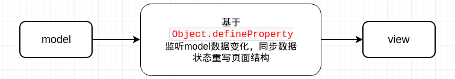

+ 基本使用：

  + 语法：`Object.defineProperty(obj, prop, descriptor)`
  + 参数：

    + `obj`要在其上定义属性的对象。
    + `prop`要定义或修改的属性的名称。
    + `descriptor`将被定义或修改的属性描述符。
+ 返回：被传递给函数的对象。

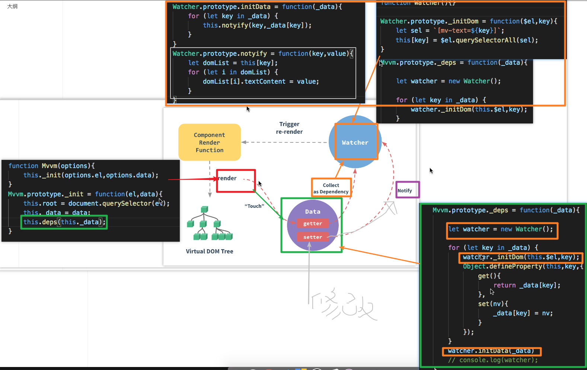


### 5.4、双向数据绑定指令v-model

+ 基于响应式原理和元素事件监听实现响应式功能

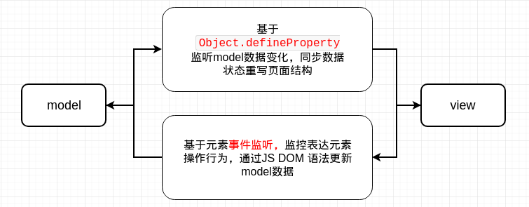

- 取值：随表单控件类型不同而不同。
- 限制：**仅限于HTML表单输入或选择元素元素**，`<input>`、`<select>` 、`<textarea>`
  - **HTML 5 可以通过属性方式将 DIV 变成 多行输入框（富文本框）**
- 语法：`<input type="text" v-model="name">`

```html
<!DOCTYPE html>
<html lang="en">
<head>
    <meta charset="UTF-8">
    <meta name="viewport" content="width=device-width, initial-scale=1.0">
    <meta http-equiv="X-UA-Compatible" content="ie=edge">
    <title>Document</title>
    <style>
        body{
            margin-bottom: 500px;
        }
    </style>
    <script src="./js/vue.js"></script>
</head>
<body>
    <textarea name="" id="aa" cols="30" rows="5" value="22222" ></textarea>
    <br>
    <form action="#" method="get">
        <input type="radio" name="sex" id="" value="m">
        <input type="radio" name="sex" id="" value="f">
        <input type="radio" name="sex" id="" value="unkown">
        <input type="submit" value="提交">
    </form>
    <br>
    <input type="radio" name="aa" id="">
    <input type="radio" name="aa" id="">
    <input type="radio" name="aa" id="">
    <hr>
    <div id="app">
        <!-- 
            1、单行文本框
                双向数据绑定实际上就是 数据劫持+事件绑定
                + 对于单行文本框而言，数据劫持和v-bind:value 实现内存到页面的响应,
                  v-on:input 实现了页面输入变化到内存数据更新
                + v-model 实际上就是 v-bind 和 v-on 的 整合指令
        -->
        <p>msg:{{ msg }}</p>
        <input type="text" :value="msg" @input=" msg = $event.target.value ">
        <input type="text" v-model="msg">
        <hr>
        <p>文本框的扩展（除 radio 和 checkbox）</p>
        <p>双向数据绑定依然是对 元素的 value属性的操作</p>
        <span>{{ color }}</span>
        <input type="color" :value="color" @input=" color=$event.target.value ">
        <input type="color" v-model="color">
        <hr>
        <span>{{ day }}</span>
        <input type="date" :value="day" @input=" day=$event.target.value ">
        <input type="date" v-model="day">
        <hr>
        <span>{{ num }}</span>
        <input type="range" min="0" max="10" step="1" :value="num" @input=" num=$event.target.value ">
        <input type="range" min="0" max="10" step="1" v-model="num">
        <!-- 
            2、多行文本域
                * 在页面定义时，标签 textarea 没有 value attr属性，
                  所以定义页面时，采用正反标签中的定义值作为初始值；
                  textarea 转化为 JS dom对象后，以正反标签中的值作为 value第一次初始值，
                  后续用户的交互，只会对DOM元素 value prop 属性进行操作
                + 对于 多行文本域而言
                    v-model 实际上就是 v-bind:value 的dom属性绑定，和 v-on:input的事件绑定
        -->
        <pre>info:{{ info }}</pre>
        <textarea cols="10" rows="5" @input=" info=$event.target.value ">{{ info }}</textarea>
        <textarea cols="10" rows="5" v-bind:value=" info " @input=" info=$event.target.value ">asdasdasd</textarea>
        <textarea cols="10" rows="5" v-model=" info "></textarea>
        <hr>
        <!--  
            3、单选按钮
                + v-model 对于单项按钮实际上就是 对 checked属性的控制和对 change方法的定义
                + 单选按钮的 v-model的绑定中 checked 属性的操作取决于 当前标签的 value属性定义
                + v-model 为单选按钮进行定义是，如果没有定义 value 属性
                    当选择该单选按钮时，vue认为当前单选按钮为定义value属性值，直接返回 null
        -->
        <span>radioFlag:{{ radioFlag }}</span>
        <input type="radio" value="M" :checked=" radioFlag " @change=" radioFlag=true ">
        <input type="radio" value="F" :checked=" radioFlag " @change=" radioFlag=true ">
        <input type="radio" value="unkown" :checked=" radioFlag " @change=" radioFlag=true ">
        <br>
        <span>radionData:{{ radionData }}</span>
        <input type="radio" value="M" :checked=" radionData=='M' " @change=" radionData=$event.target.value ">
        <input type="radio" value="F" :checked=" radionData=='F' " @change=" radionData=$event.target.value ">
        <input type="radio" value="unkown" :checked=" radionData=='unkown' " @change=" radionData=$event.target.value ">
        <br>
        <input type="radio" value="M" v-model="radionData">
        <input type="radio" value="F" v-model="radionData">
        <input type="radio" value="unkown" v-model="radionData">
        <br>
        <input type="radio" v-model="radionData1">
        <input type="radio" v-model="radionData1">
        <input type="radio" v-model="radionData1">
        <hr>
        <!--  
            4、多选按钮
                + v-model 绑定多选按钮时,以取值类型执行对应功能的
                    - 取值为非数组（Array）数据，v-model会直接记录复选框的状态（true表示选择，false 表示未选中）
                    - 取值为数组数据，定义相同的变量属性的 复选框会直接作为统一组别
                        * 如果标签上未提供 value 属性，当选中任意复选框，会直接将null作为值追加到数组中
                          所有和当前数组绑定的元素，都会通过判断标签value的值在数组中是否存在，描述标签是否选中
                        * 如果标签上提供 value 属性，当选中该复选框时，会将该复选框的value属性值追加到数组中
                          数组中记录的 value数据是无序的
                + v-model 绑定多选按钮的扩展功能
                    取值为非数组时，可以通过为标签绑定 true-value 或者 false-value 实现对于选中和不选中的取值在的修改
        -->
        <p>checkData:{{ checkData }}</p>
        <input type="checkbox" value="a1" v-model="checkData">
        <input type="checkbox" value="a2" v-model="checkData">
        <input type="checkbox" value="a3" v-model="checkData">
        <input type="checkbox" value="a4" v-model="checkData">
        <br>
        <input type="checkbox" :checked=" checkFlag " @change=" checkFlag=!checkFlag ">
        <input type="checkbox" :checked=" checkFlag " @change=" checkFlag=!checkFlag ">
        <input type="checkbox" :checked=" checkFlag " @change=" checkFlag=!checkFlag ">
        <input type="checkbox" :checked=" checkFlag " @change=" checkFlag=!checkFlag ">
        <br>
        <input type="checkbox" value="b1" :checked=" checkData1.indexOf('b1')!=-1 " @change=" changeArr($event.target.value) ">
        <input type="checkbox" value="b2" :checked=" checkData1.indexOf('b2')!=-1 " @change=" changeArr($event.target.value) ">
        <input type="checkbox" value="b3" :checked=" checkData1.indexOf('b3')!=-1 " @change=" changeArr($event.target.value) ">
        <input type="checkbox" value="b4" :checked=" checkData1.indexOf('b4')!=-1 " @change=" changeArr($event.target.value) ">
        <br>
        <input type="checkbox" true-value="同意协议" false-value="不同意协议"  v-model="checkData2">
        <hr>
        <!--  
            5、下拉列表
                + v-model 只用于操作 select 标签，通过对DOM 属性 value的 绑定和 change事件的处理
                  控制 option的 切换和选中，取值遵循 select 在原始 HTML和JS中的规则
        -->
        <p>selectData:{{selectData}}</p>
        <select :value=" selectData " @change=" selectData=$event.target.value ">
            <option>aa</option>
            <option value="BB">bb</option>
            <option value="CC">cc</option>
        </select>
        <select v-model="selectData">
            <option>aa</option>
            <option value="BB">bb</option>
            <option value="CC">cc</option>
        </select>
    </div>
</body>
<script>
    new Vue({
        el:"#app",
        data:{
            msg:"默认",
            info:"默认\n达到",
            color:"",
            day:"",
            num:0,
            radioFlag:false,
            radionData:"",
            radionData1:"",
            // checkData:""
            checkData:[],
            checkFlag:false,
            checkData1:[],
            checkData2:"",
            selectData:"BB"

        },
        methods: {
            changeArr(v){
                var i = this.checkData1.indexOf(v);
                if(i!=-1){
                    this.checkData1.splice(i,1);
                }else{
                    this.checkData1.push(v);
                }
            }
        },
    })

</script>
</html>
```

- 修饰符：
  - `.lazy` 取代 `input` 监听 `change` 事件
  - `.number` 输入字符串转为有效的数字
  - `.trim`  输入首尾空格过滤

```html
<!DOCTYPE html>
<html lang="en">
<head>
    <meta charset="UTF-8">
    <meta name="viewport" content="width=device-width, initial-scale=1.0">
    <meta http-equiv="X-UA-Compatible" content="ie=edge">
    <title>Document</title>
    <script src="./js/vue.js"></script>
</head>
<body>
    <div id="app">
        <p>msg:{{ msg }}</p>
        <input type="text" v-model="msg"><br>
        <!-- 
            v-model 对输入型表单元素绑定的是 input 事件，及时数据处理效果
                .lazy 修饰符主要针对的是输入型表单元素,
                      该修饰符将v-model 绑定的 input事件 切换为change事件
                      实现延迟的数据更新响应的效果
        -->
        <input type="text" v-model.lazy="msg">
        <hr>
        <!-- 
            .number 修饰为数据辅助修饰符
                将 v-model 绑定的元素输入的数据，转换为 js 的 number类型，然后进行赋值操作
                该修饰符完成 输入值得 number 化，采用的parseFloat 转换方式
                    + 首位为数字，后续可能出现字符 => 逐位判断逐位保留
                    + 首位不为数字，不在进行转换操作，直接将字符串赋值给变量
        -->
        <p>num:{{ num }}</p>
        <input type="number" v-model="num"><br>
        <input type="number" v-model.number="num"><br>
        <input type="text" v-model.number="num"><br>
        <!-- 
            .trim 实现对数据在向变量赋值前，去除用户输入的首位空格
        -->
        <p>info:{{ info }}</p>
        <input type="text" v-model="info"><br>
        <input type="text" v-model.trim="info">
    </div>
</body>
<script>
    new Vue({
        el:"#app",
        data:{
            msg:"数据",
            num:10,
            info:"info"
        }
    })
</script>
</html>
```

**练习**

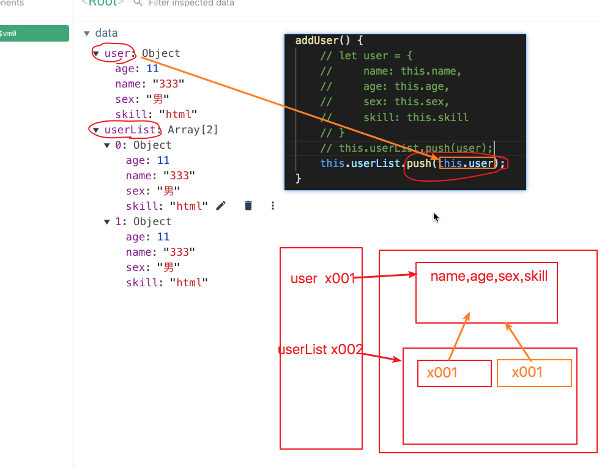


## 6、数据控制

+ 为开发者提供自定义的数据处理接口，通过开发者自定义的代码完成复杂的数据处理或者数据监控
+ 数据控制：数据包装，数据监控
  + 包装：在数据输出前，对数据进行判断组合……，完成数据的前期操作，将结果显示在页面
  + 监控：为了在数据发生变化是，执行一些特殊操作

### 6.1、计算属性 (computed)

+ 数据包装处理+数据监控操作

+ 构建方式：

  ```js
  new Vue({
      data:{},
      computed:{
          // 构建计算属性
      }
      methods:{}
  })
  ```

- 类型：`computed:{ key:value }`
  - key：取值类型string，用于==定义计算属性变量名称==，**计算属性具有 vue普通数据仓库（data）的变量功能，同时具有vue方法仓库中相同功能**
  - value：定义计算属性的相关取值
    - 取值为 Function 时，提供计算属性取值功能，此时该计算属性为**只读属性**
    - 取值为 Object { get:Function,setFunction } 时，提供计算属性取值和修改功能(**组件化时使用？**)
- 功能：用于控制数据在页面输出前，对数据进行包装处理
- 特性：
  - **计算属性 在对数据进行处理包装时，需要依赖一个当前Vue对象中普通属性（data中普通变量）**
  - **计算属性的结果 ，会随着依赖的普通属性的变换发生变换（重新调用方法）**
  - **计算属性的变量名称不能和 vue实例中其它数据仓库的名称一样**

### 6.2、过滤器 (filters)

- 功能：将向页面写入的数据，经过特定的方法 进行 包装处理，将处理后的结果展示到页面中，**页面的最终结果上来说，过滤器和计算属性功能相似**

- 范围：滤器可以用在两个地方：**双花括号插值和 v-bind 表达式** (后者从 2.1.0+ 开始支持)

- 语法：在页面中通过管道符`|`，连接待处理变量和过滤器方法 

  ```html
  <!-- 在双花括号中 -->
  {{ 待处理变量 | 过滤器方法名 }}
  {{ 待处理变量 | 过滤器方法名() }}
  
  <!-- 在 `v-bind` 中 -->
  <div v-bind:id="待处理变量 | 过滤器方法名"></div>
  <div v-bind:id="待处理变量 | 过滤器方法名()"></div>
  ```

#### 1、局部过滤器

- **仅限于 定义过滤器时 所参考的 vue实例对象的 容器中**
  - 局部过滤器的定义方式:   **需要定义在一个 已经存在的 vue实例中**
  - 局部过滤器的使用范围：**在定义过滤器的 vue对象的 容器才可使用**
- 定义局部过滤器

```js
new Vue({
    filters:{
        // key 描述过滤器名称
        // value 描述过滤器 执行方法
        testFilter:function(){
            return "";  //过滤器而言，因为需要将结果展示在页面中，所有方法必须存在返回值
        }
    }
})
```

#### 2、全局过滤器

- **使用 Vue 装载 新的 过滤器方法，提供给当前项目中所有的vue实例使用**
  - 全局过滤器的定义方式:   **通过为 Vue 构造方法增加 新的方法 完成 过滤器的定义（全局配置）**
  - 全局过滤器的使用范围：**所有的vue实例的容器中都可以使用**
- 全局过滤器定义
  - 全局定义 需要依赖于 Vue构造器对象
  - ==全局过滤器 一定要在 vue实例构建之前定义==
  - 语法：Vue.filter( id, [definition\] )
    - id == name : 定义过滤器名称(过滤器的方法名) 取值为 string，具有**唯一性 **
    - definition ： 过滤器的执行方法（**和局部过滤的方法特性一样**），是一个匿名方法
  - **如果全局过滤器名称和局部过滤器名称相同**
    - **过滤器可以共存，但定义局部过滤器的实例中无法使用全局过滤器，因为局部过滤器优先级高于全局过滤器**
- 定义全局过滤器

```js
Vue.filter("formatDate",function(date){
    console.log("全局过滤器：",date);
    return "全局过滤器";
})
```

### 6.3、监视器 (watch)

+ 功能：构建一个对Vue实例中数据仓库中变量（data，computed）的监控方法，**实现当数据变化时执行额外扩展方法**

+ 组件内构建方式：

  ```js
  var vm = new Vue({
      watch: {
         	key:value
      },
  })
  ```
  + key（string）：被监视的数据变量名称==或对象路径表示方式==

    + **!注意! : 对象路径表示形式只能用于Vue的监视器定义时**

  + value（Function|Object）: 定义监视器执行方式

    + 取值 Function : 定义基础的数据监控方法

    + 取值 Object : 定义可扩展数据监控配置

      ```js
      {
          handler: Function 定义监控方法
          deep: Boolean 是否开启深度监视
          immediate: Boolean 是否开启初始化触发
      }
      ```

  ```html
  <!DOCTYPE html>
  <html lang="en">
  
  <head>
      <meta charset="UTF-8">
      <meta name="viewport" content="width=device-width, initial-scale=1.0">
      <meta http-equiv="X-UA-Compatible" content="ie=edge">
      <title>Document</title>
      <script src="./js/vue.js"></script>
      <script src="./js/jquery.js"></script>
  </head>
  
  <body>
      <div id="app">
          <p>num:{{ num }}</p>
          <input type="button" value="+" @click="num = num + 1">
          <input type="button" value="-" @click="num = num - 1">
          <hr>
          <!-- 
          2.6版本下述操作已经修正
          -->
          <!-- 
              <input type="button" value="+" @click="num++">
              <input type="button" value="+" @click="num+=1"> 
          -->
          <p>user:{{ user }}</p>
          <input type="text" v-model="user.name"><br>
          <input type="text" v-model="user.age"><br>
          <input type="button" value="重置user对象" @click=" resetUser() ">
          <hr>
          <p>arr:{{ arr }}</p>
          <input type="text" v-model="arr[1]"><br>
          <hr>
          <p>obj:{{ obj }}</p>
          <input type="text" v-model="obj.a"><br>
          <input type="button" value="重置obj"  @click=" resetObj() ">
      </div>
  </body>
  <script>
      new Vue({
          el: "#app",
          data: {
              num: 10,
              user:{
                  name:"tom",
                  age:23
              },
              arr:[1,2,3,4],
              obj:{
                  a:11,
                  b:"bb"
              }
          },
          watch: {
              num(nv,ov){
                  console.log(nv,ov);
              },
              /*
                  vue 的watch监视是对定义的监视变量的直接指向值的监控
                  例如：
                      下面的user监控，因为user变量是引用数据类型，所以直接指向值为一个堆的地址
                      因此，user的watch监视器，监控的是该变量的 地址变化 
              */
              // user:function(){
              //     console.log("user被改变");
              // },
              // watch 定义时 key的一个特殊形式字符串的取值
              // 对象属性定义地址字符串方式定义
              // 下面的定义方式，表示需要vue监控 user对象中的name属性变化
              "user.name":function(){
                  console.log("user.name属性的变化");
              },
              // watch定义时，value取值为 object时，属于为监控变量开启特殊监控处理法方法
              user:{
                  // 监控对象的配置 必须使用 vue提供的 固定关键字进行描述
                  // handler 属性是用于描述监视的 回调函数
                  handler:function(){
                      console.log("user-object监视配置的 handler方法")
                  },
                  // 修改watch变量的监控模式
                  //    浅监控：watch监控器默认值监控定义变量的 直接指向值
                  //    深监控：不仅监视定义变量的直接指向值，如果变量为引用类型，引用类型的值同样会被监控
                  // deep:true|false(默认取值)
                  deep:true
              },
              // vue 只能监控数组直接值，无法监控元素变化
              // "arr[1]":function(){
              //     console.log("arr[1]")
              // }
              arr:{
                  handler(){
                      console.log("arr的监控方法")
                  },
                  deep:true
              },
              // watch监控时，如果被监控的数据变量为引用类型,并且开启深度监视，通过修改对象的属性值，触发监控
              //     此时监控回调的 nv 和 ov 将是相同的新数据值
              // obj:function(nv,ov){
              //     console.log("obj-new-value:",nv);
              //     console.log("obj-old-value:",ov);
              // }
              obj:{
                  handler(nv,ov){
                      console.log("obj-new-value:",nv);
                      console.log("obj-old-value:",ov);
                  },
                  deep:true
              }
          },
          methods: {
              resetUser(){
                  this.user = {
                      name:'jack',
                      age:33
                  }
              },
              resetObj(){
                  this.obj = {
                      a:"aaa",
                      b:111
                  }
              }
          },
      });
      // var arr = [1,2,3,4,5];
      // // 数组下标的标准叫法，地址偏移量
  </script>
  
  </html>
  ```

  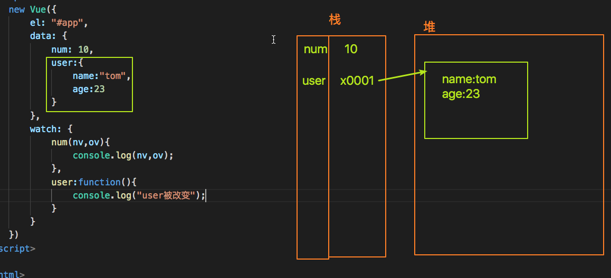

  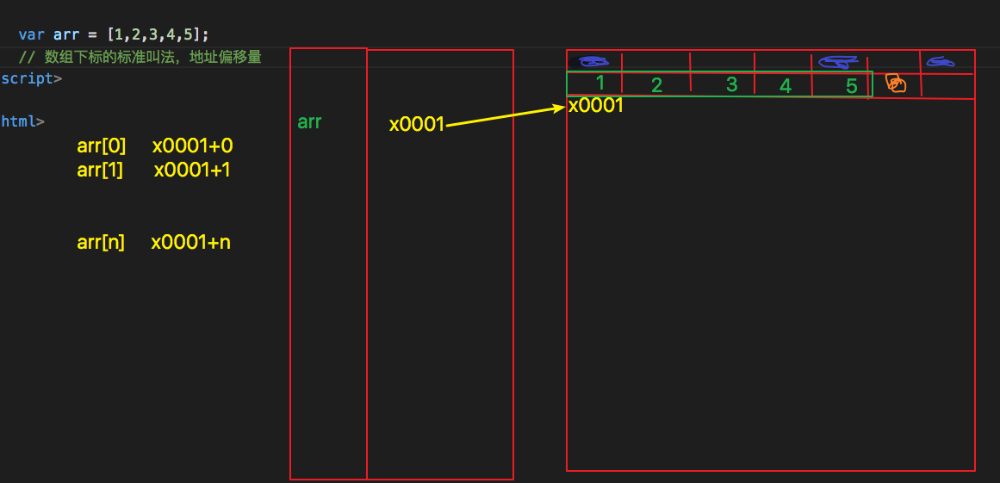

  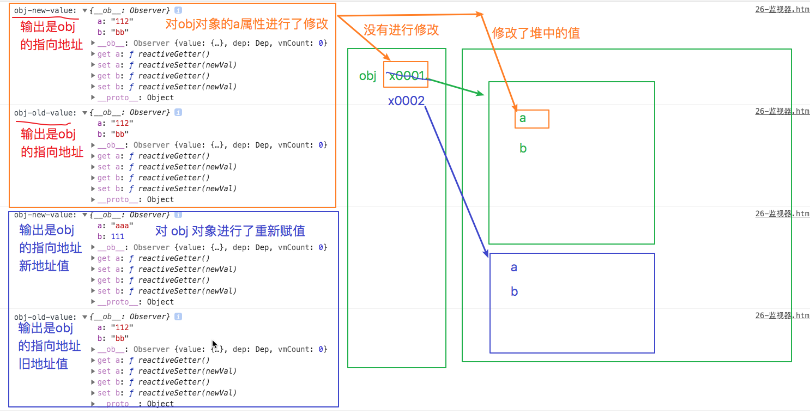

+ 组件外构建

  ```js
  var vm = new Vue({……})；
  var unwatch = vm.$watch( expOrFn, callback, [options] )
  ```

  + expOrFn（string|Function）被监视的数据变量名称、==对象路径表示方式==、==多变量配置方法==

    + 取值为string ：被监视的数据变量名称==或对象路径表示方式==
    + 取值为Function：被监视的==多变量配置方法==

  + callback（Function）: 定义的监控处理方法

  + options （Objecy）：定义监控扩展功能

  + 返回值 unwatch （Function）: 返回一个用于关闭销毁销毁当前监控的方法

    ```js
    {
        deep: Boolean 是否开启深度监视
        immediate: Boolean 是否开启初始化触发
    }
    ```

### 6.4、计算属性、过滤器、监视器

+ 计算属性
  + 依赖于Vue实例,只能在实例中定义使用
  + 调用时不能接收额外参数，必须依赖vue实例中的 一个或 多个固定数据变量
  + 计算属性默认是只读属性，但是可以在定义时使用对象模式，开启可读写模式
  + **计算属性会对结果进行缓存操作**
    1. 如果依赖变量没有变化，计算属性方法不被触发，直接从缓存中进行读取；
    2. 如果依赖变量发生变化，会重新执行一次方法
  + 计算属性是被作为一个对象属性使用
+ 过滤器
  + 可以根据需要选择全局过滤器或局部过滤器
  + 调用时可以接收多个参数，其中包含待处理数据，因此可以不依赖于固定vue实例
  + 过滤器只能完成对于被过滤数据的读取操作，无法进行设置操作
  + **过滤不具有缓存特性，页面中定义调用一次必然会重新执行一次**
  + 过滤是被作为一个特殊的处理方法使用
+ 监视器
  + 依赖于Vue实例的固定变量，可以在实例中定义，也可以在全局中通过实例对象进行定义
  + 监视器不能被调用，只能由Vue检测变量变化自动执行，方法默认自带两个参数 oldValue和newValue
  + 监视可以完成对固定变量的监控和修改操作
  + 监视器被作为Vue功能的扩展接口使用

## 7、页面模板和render函数

+ vue实例在项目运行时构建的 页面  容器结构的方式

+ Vue对象构建时需要为对象指定页面构成，该构成称之为模板
+ 在基本构成vue对象时通过 el 指定**构成的页面模板**，**同时指定页面位置**
+ **用于构建模板的标签结构必须有且仅有一个根节点元素**
+ **vue项目运行后，你定义的页面结构，不是vue操作的页面结构  （你看到的不是你定义的）**

#### 1、模板属性 (template)

+ Vue实例添加 `template` 属性，可以独立定义页面构成模板
+ template 构成的模板 **最终会替换到 el 的指向位置**

+ 示例:

  ```js
  var vm = new Vue({
      el: '#app',
      template:StringDOM | StringEl
  });
  ```

  + StringDOM：HTML标签的字符串定义方式
  + StringEl：HTML元素选择器

#### 2、模板渲染函数（render）

+ Vue实例添加 `render` 属性函数，可以独立定义JS模板构成函数

+ render 构成的模板==具有最高优先权==， **最终会替换到 el 的指向位置**，且template属性失效

+ 示例:

  ```js
  var vm = new Vue({
      el: '#app',
      data:{
          title:"标题"
      },
      render: function (createElement) {
          return createElement('h4', 'render'+this.title);
      }
  });
  ```
  + render 属性取值为一个固定函数**`function (createElement) {}`**，该函数返回构成的模板
  + createElement 为渲染函数的固定参数，**该参数可用于以方法方式构建页面模板**

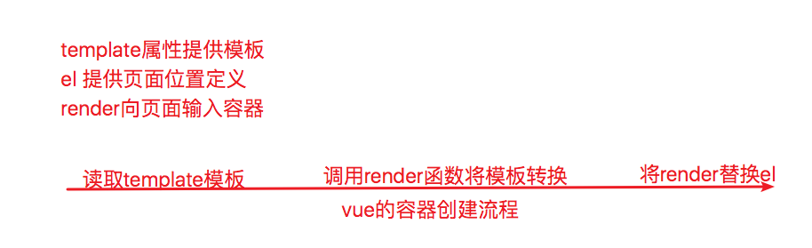

## 8、实例属性和方法

+ 实例
  + JS中通过构造函数创建的对象，统称为当前构造函数的实例
  + vue中的实例属性和实例方法，就是vue创建的对象所包含的属性和方法
  + vue中以 $ 符号开头的 属性和方法 都是 vue的实例属性和方法

+ Vue中对部分特殊的属性和功能方法进行特殊指代定义，用于提供独立的执行和获取方式

+ Vue的实例属性和方法以统一规范以 **`$`** 开头

+ 相关实例属性和方法 
  + vm.$el：描述当前Vue实例使用的根 DOM 元素对应容器。
  + vm.$data：描述当前Vue实例观察的数据对象。
  + vm.$options：构建当前 Vue 实例的初始化选项。
  + vm.$refs：返回一个对象，记录当前Vue实例模板中，**定义了ref属性**的所有 DOM 元素和**子组件实例**。
  + vm.$parent：返回当前组件的父组件实例
  + vm.$children：返回当前组件定义的所有的子组件实例构成的数组
  + vm.$attr : 返回绑定在该组件自定义标签上的 属性

  **实例方法**

  + vm.$emit : 用于触发子组件上定义的自定义事件

  + vm.$mount：手动挂在Vue实例，可以在vue定义式不会指定页面容器的位置，在后续程序运行时手动挂载vue实例容器
  + vm.$destroy：手动销毁Vue实例，只销毁对应的vue实例，但实例在页面中的DOM结构不会删除
  + vm.$nextTick：等同于 `Vue.nextTick` ，将执行函数体延迟到页面DOM更新完成后执行
  + vm.$watch：构建一个对Vue实例中数据仓库中变量（data，computed）的监控方法

  ```html
  <!DOCTYPE html>
  <html lang="en">
  <head>
      <meta charset="UTF-8">
      <meta name="viewport" content="width=device-width, initial-scale=1.0">
      <meta http-equiv="X-UA-Compatible" content="ie=edge">
      <title>Document</title>
      <script src="./js/vue.js"></script>
      <script>
          // 同步代码一定具有时间执行顺序
          // 代码必须按照定义顺序先后进行执行，如果前面的代码没有执行完成，后续代码将无法执行
          // console.log("aaaa");
          // alert(1);
          // console.log("bbbbb");
          // for (let i = 0; i < 10000; i++) {
          //    console.log(1)
          // }
          // console.log("aaaa");
  
          // 异步代码，不会严格按照时间顺序执行代码
          // 异步代码的定义先后，并不表示代码的执行先后，同时也不会影响后续代码的执行
          //      异步代码只按照自己定义的代码来决定执行的顺序
          // console.log("aaaa");
          // setTimeout(function(){
          //     alert(1);
          //     console.log("ccc");
          // },0)
          // console.log("bbbbb");
      </script>
  </head>
  <body>
      <div id="app">
          <h1 ref="h1dom">{{ msg }}</h1>
          <input type="button" value="msg重新赋值" @click="setMsg()">
          <hr>
          <p>info:{{ info }}</p>
          <input type="text" v-model="info">
          <input type="button" value="开启info监控" @click="openWatch()">
          <input type="button" value="关闭info监控" @click="closeWatch()">
          <hr>
          <p>{{ user }}</p>
          <input type="text" v-model="user.name">
          <input type="text" v-model="user.age">
          <input type="text" v-model="user.skill">
      </div>
  </body>
  <script>
      var vm = new Vue({
          el:"#app",
          data:{
              msg:"测试数据",
              info:"测试$watch",
              // unwatch:null
              user:{
                  name:"tom",
                  age:23,
                  skill:"html"
              }
          },
          // watch 属性定义的监视器，一旦定义完成，将无法关闭
          // watch 属性定义的监视器，一般都是一个数据变量一个监控器
          // watch: {
          //     msg(nv,ov){
          //         console.log("msg发生变化")
          //     },
          //     // "user.age"
          //     // "user.skill"
          // },
          methods: {
              setMsg(){
                  var temp1 = this.$refs.h1dom.innerHTML;
                  console.log("赋值之前：",temp1);
  
                  // 1、对内存中msg变量进行修改 = 及时同步
                  // 2、内存变量发生变化，启动对应DOM的渲染方法，重新渲染DOM。并将渲染后的结果写到页面
                  //      = 异步执行代码
                  this.msg = "新值";
                  
                  // setTimeout(()=>{
                  //     var temp2 = this.$refs.h1dom.innerHTML;
                  //     console.log("赋值之后：",temp2);
                  // },1000)
  
                  // 将定义的方法 直接延迟到页面中DOM更新完成后执行
                  // this.$nextTick(()=>{
                  //     var temp2 = this.$refs.h1dom.innerHTML;
                  //     console.log("赋值之后：",temp2);
                  // })
                  Vue.nextTick(()=>{
                      var temp2 = this.$refs.h1dom.innerHTML;
                      console.log("赋值之后：",temp2);
                  })
              },
              openWatch(){
                  // this.$unwatch 开发者模拟自建 实例属性和方法
                  this.$unwatch = this.$watch("info",function(nv,ov){
                      console.log("info发生变化",nv,ov,this);
                  });
              },
              closeWatch(){
                  this.$unwatch();
              }
          },
      })
  
      // $watch 定义的监控器，可以通过返回监控器对象进行关闭
      // vm.$watch(expOrFn, callback, [options] );
      //  expOrFn 描述被监控的变量
      //          exp string描述的被监控变量名称或者对象 取值路径
      //          fn 描述监控变量的构成执行方法
      //  callback 是变量发生变化时执行的方法
      //  options 监控的额外配置项  deep immediate 是否开启初始化执行
      //  方法返回当前 变量的 监控器对象 的关闭方法，通过执行该方法可以关闭 该变量的监控
      // var unwatch = vm.$watch("info",function(nv,ov){
      //     console.log("info发生变化",nv,ov);
      // });
      // setTimeout(() => {
      //     unwatch();
      // }, 3000);
  
      vm.$watch(function(){
          // 在该函数中通过实例对象 调用方法进行拼接返回
          // 该监视器，会直接监视方法中定义的相关变量变化
          // return this.user.age + this.user.skill;
          // return [this.user.age,this.user.skill];
          return {
              age:this.user.age,
              skill:this.user.skill
          }
      },function(nv,ov){
          // nv 和 ov 是上述方法的返回结果
          console.log("该回调函数将会在上述方法内部定义的变量发生变换时执行",nv,ov)
      })
  </script>
  </html>
  ```

  + vm.$set：等同于 `Vue.set` ，手动为实例中没有数据监听的变量添加监视功能(数据劫持)
  + vm.$delete：等同于 `Vue.delete` ，手动为实例中的变量删除监视功能（数据劫持）

```html
<!DOCTYPE html>
<html lang="en">
<head>
    <meta charset="UTF-8">
    <meta name="viewport" content="width=device-width, initial-scale=1.0">
    <meta http-equiv="X-UA-Compatible" content="ie=edge">
    <title>Document</title>
    <script src="./js/vue.js"></script>
</head>
<body>
    <div id="app">
        <p>user:{{ user }}</p>
        <input type="text" v-model="user.name">
        <input type="button" value="添加年龄" @click="addAge()">
        <hr>
        <p>user1:{{ user1 }}</p>
        <!-- 
            在定义vue实例的数据仓库时，虽然没有定义对应的属性，
                但v-model依然可以自行完成劫持功能
                除v-model以外的其它属性写入方法（插值表达式和其它指令），无法完成数据劫持
        -->
        <input type="text" v-model="user1.name">
        <input type="text" v-model="user1.age">
        <p>user1.skill:{{ user1.skill }}</p>
        <p v-text="user1.skill"></p>
        <input type="button" value="添加技能" @click="addSkill()">
        <hr>
        <p>arr:{{ arr }}</p>
        <input type="button" value="修改下标1的值" @click=" arr[1]='ccc' ">
        <input type="button" value="添加新数据" @click=" arr[arr.length]='ddd' ">
        <!-- 
            vue对于数组的数据响应变量，只能局有限 vue 内置重写的 变异方法上
            原生JS中对于数据的所有下标操作，属性操作将无法完成响应式功能
        -->
        <input type="button" value="添加新数据" @click=" arr.push('eeee') ">
        <hr>
        <p>user.aaa:{{ user.aaa }}</p>
        <input type="text" name="" id="" v-model="user.aaa">
        <input type="button" value="删除数据劫持" @click="deleteAaa()">
    </div>
</body>
<script>
    var vm = new Vue({
        el:"#app",
        data:{
            user:{
                name:"tom",
                aaa:"aaa"
            },
            user1:{},
            arr:[1,2]
        },
        methods: {
            addAge(){
                // 在vue对象创建完成后，为数据变量增加的新属性，不会执行Object.defineProperty
                // 因此新增加的属性在vue中将不会开启 数据拦截和响应功能
                // this.user.age = 23;
                // this.$set(target,key,value)
                // target 添加监控的目标对象,不能直接对vue实例的 data 、computed 等数据仓库属性直接操作
                // key 被监控的变量名称
                // value 添加的监控中
                // this.$set(this.user,"age",23);
                // this.$set(this.$data,"info","aaaa");
                Vue.set(this.user,"age",33);
                console.log(this);
            },
            addSkill(){
                this.user1.skill = "html";
            },
            deleteAaa(){
                console.log(this);
                // this.$delete(target,key);
                // target 被删除的数据劫持变量的所属对象
                // key 被删除的变量名称
                // $delete 删除的不仅包含该变量的劫持功能，同时包含数据变量本身
                this.$delete(this.user,"aaa")
            }
        },
    });
</script>
</html>
```

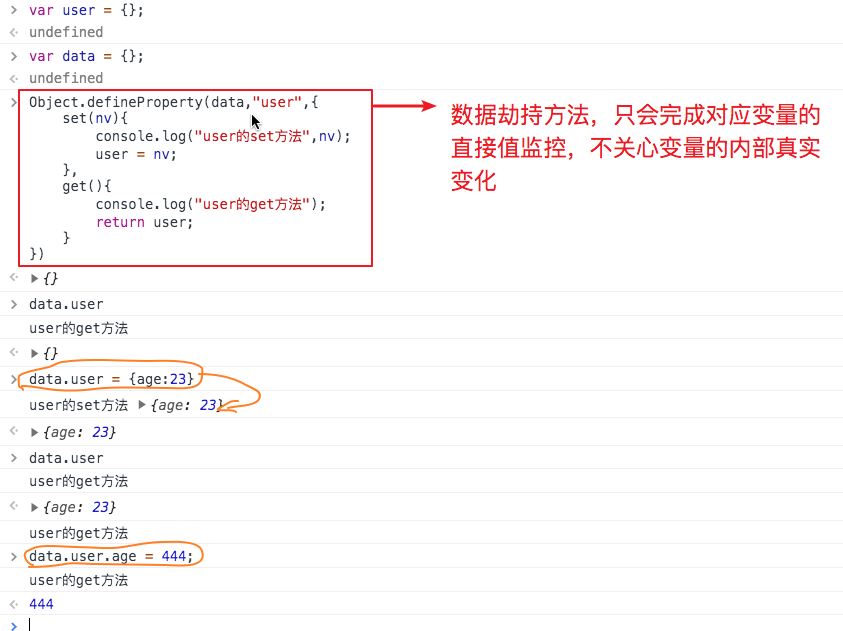

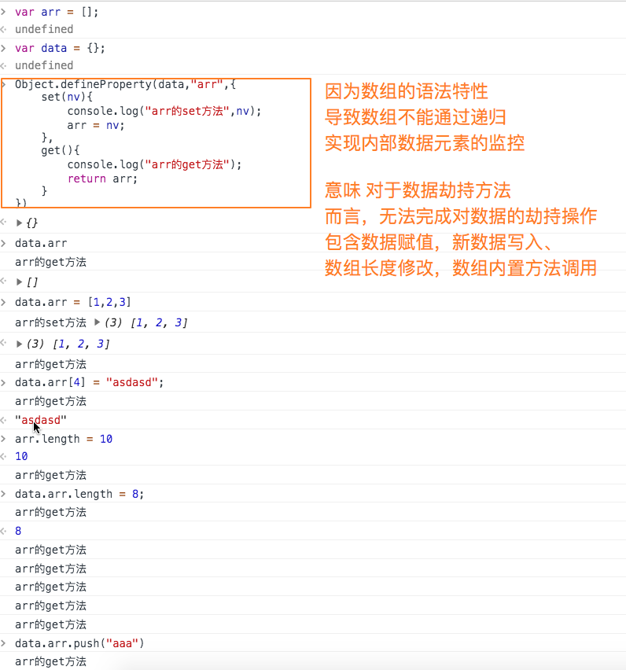

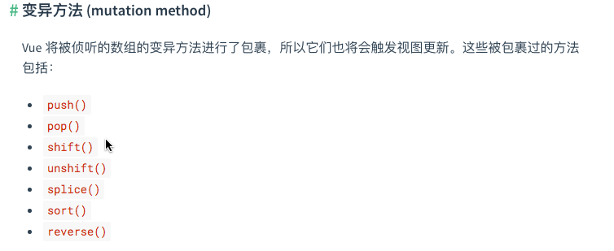


