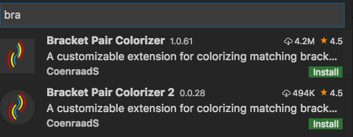

# vue进阶篇

***陈华旺-chenhuawang@itany.com***

[TOC]

## 1、生命周期

+ 生命周期：**一段代码从 创建 到 销毁的 完成过程**

+ 钩子函数: **Vue对外提供的在一些特定代码执行时间段上的回调函数**

  ```js
  new Vue({
      // 在实例初始化之后，数据观测 和 事件配置之前被调用。
      beforeCreate:function(){}, 
      // 在实例创建完成后被立即调用
      created:function(){},
      // 在挂载开始之前被调用：相关的 render 函数首次被调用。
      beforeMount:function(){},
      // el 被新创建的 vm.$el 替换，并挂载到实例上去之后调用该钩子
      mounted:function(){},
      // 数据更新时调用，发生在虚拟 DOM 打补丁之前。这里适合在更新之前访问现有的 DOM
      beforeUpdate:function(){},
      // 由于数据更改导致的虚拟 DOM 重新渲染和打补丁，在这之后会调用该钩子。
      updated:function(){},
      // 实例销毁之前调用。在这一步，实例仍然完全可用。
      beforeDestroy:function(){},
      // Vue 实例销毁后调用。调用后，Vue 实例指示的所有东西都会解绑定，所有的事件监听器会被移除
      destroyed:function(){}
  })
  ```

+ 生命周期流程


## 2、自定义指令

- 除了核心功能默认内置的指令 ，Vue 也允许注册自定义指令。
- 功能：**对页面展示效果功能的扩展==> 自定义指令 主要完成的是 页面DOM元素的操作**
  - MVVM 设计模式核心思想： 简化开发者对于DOM的操作，vue基本实现了相关操作，基本上不需要完成DOM的操作
  - **vue简化开发者对于DOM的操作，实际上就是 将DOM的操作封装成插值表达式或者指令**
- 自定义指令是vue提供给开发者 对DOM操作的接口（规范化的方法）

### 2.1、局部指令定义

+ 范围：仅限于定义时关联的 vue 实例的容器中使用

+ 定义：

  ```js
  new Vue({
      directives:{ key[string]:value[Fuction]  }
  })
  ```

  + key（string）：指令名称 ，定义完成后，页面使用需 `v-` 前缀调用指令
    + 如果名称为驼峰命名方式 （例如 imgLazy） ,页面使用时需要转换为 连字符 （v-img-lazy）
  + value（Function）：`function( el，binding，newVnode,oldVnode ){}`  指令执行函数
    + el  :  调用指令的当前DOM对象
    + binding : 是一个对象 ，对象中包含了指令构成**参数、修饰符、取值 ……**
      - name:  **指令名称**
      - rawName: **指令调用时的表达式**
      - expression:  **指令取值表单时，` =` 右侧的取值表达式**
      - arg:  **指令参数 , `:` 后定义的参数名称**
      - oldArg: **是指令 ： 后定义的 旧的参数名称**
      - value: **指令 = 右侧 表达式的计算结果**
      - oldValue:**指令绑定变量发生变化后，调用该方法时 ，存储的 上次的结果值**
      - modifiers: **指令修饰符，`.`后定义的修饰符名称**
        - **modifiers 为 Object{ key:value } 类型数据**
        - **key 为修饰符名称，value取值 为 true**
          - $true 作为value表示当前指令被启用$
          - $对象中没有修饰符key ,表示指令不启用$
          - $当没有修饰符时，表示该对象为空对象$
    + newVnode：指令更新后的新虚拟DOM
    + oldVnode：指令更新前的旧虚拟DOM

+ 使用：`<标签 v-自定义指令名[:参数][.修饰符.修饰符……][=取值] ></标签>`

### 2.2、全局指令定义

+ 范围：可以在 vue 的 任意对象的容器中使用

+ 语法：`Vue.directive( id,definition )`

  - id=name : 定义指令名称
  - definition :指令的处理函数，`function( el，binding，newVnode,oldVnode ){}`
    - 参数**参考 局部指令**

+ 定义：**全局指令定义必须在使用之前**

  ```js
  Vue.directive("lazy",function( el，binding，newVnode,oldVnode ){
      
  })
  ```

### 2.3、指令生命周期

+ 一个指令从项目运行开始，到指令运行结束过程，vue为每个指令都提供固定的生命周期钩子函数
  + `bind`：只调用一次，指令第一次绑定到元素时调用。在这里可以进行一次性的初始化设置。
  + `inserted`：被绑定元素插入父节点时调用 (仅保证父节点存在，但不一定已被插入文档中)。
  + `update`：所在组件的 VNode 更新时调用，**但是可能发生在其子 VNode 更新之前**。指令的值可能发生了改变，也可能没有。但是你可以通过比较更新前后的值来忽略不必要的模板更新 (详细的钩子函数参数见下)。
  + `componentUpdated`：指令所在组件的 VNode **及其子 VNode** 全部更新后调用。
  + `unbind`：只调用一次，指令与元素解绑时调用。
+ 无论是全局指令定义，还是局部指令定以，definition取值可以为 Function 也可以为 Object
  + 取值 Function，定义功能就是指令的处理函数
  + 取值Object，定义的时指令的生命周期钩子函数的处理方法

## 3、组件化

+ 组件是可复用的 Vue 实例，且带有一个名字，项目中把组件作为自定义元素来使用

+ 组件构成：**将项目中可能被重复使用的页面结构 (包含HTML,css，js)，转换为vue的 一个组件实例，以组件组合的方式 构成 整个项目结构**，或将特殊实现功能封装成组件进行特殊调用

  + 组件就是一个vue实例，但不是通过 直接 new Vue 所定义的

  > 什么是H5?
  >
  > ​	HTML5+CSS+JS


### 3.1、构造器继承函数

+ 构造器继承函数 `Vue.extend()` ，通过以**基础 Vue 构造器为蓝本**，创建一个具有**特殊配置的“子类”构造器**。

+ 被创建的新构造器可以用于构建Vue实例，但被构建的实例具有预先定义的相关特性
+ 项目中可通过该功能构建具有特殊用途的Vue的实例

+ 构造器继承函数语法：`Vue.extend( options )`
  + 返回一个新的具有Vue基本功能和特殊配置的新构造函数
  + options：该参数用于定义新构造器的相关特性，**该配置项等同于 `new Vue(options)`** 的options参数


+ 示例：

  ```js
  // 创建构造器
  var Profile = Vue.extend({
    template: '<p @click="printMsg()">这是一个特殊的Vue实例</p>',
  	methods: {
      printMsg(){
        console.log("自定义组件构造器创建的组件")
      }
    }
  })
  // 创建 Profile 实例，并挂载到一个元素上。
  new Profile().$mount('#mount-point');
  // 创建 Profile 实例，并执行空挂载
  new Profile().$mount();
  ```

###### options配置中的el属性

+ **限制**：只在由 `new Vue()` 创建的实例中使用。
+ **详细**：
  + 提供一个在页面上已存在的 DOM 元素作为 Vue 实例的挂载目标。可以是 CSS 选择器，也可以是一个 HTMLElement 实例。
  + 在实例挂载之后，元素可以用 `vm.$el` 访问。
  + 如果在实例化时存在这个选项，实例将立即进入编译过程，否则，需要显式调用 `vm.$mount()`手动开启编译。

###### options配置中的data属性

+ **类型**：`Object | Function`
+ **限制**：只有在 `new Vue()`中取值为 Object，==组件或构造器定义只接受 `function`==。
+ **详细**：Vue 实例的数据对象。
  + Vue 将会递归将 data 的属性转换为 getter/setter，从而让 data 的属性能够响应数据变化。
  + 当一个**组件**或**构造器**被定义，`data` 必须声明为返回一个初始数据对象的函数
    + 因为组件可能被用来创建多个实例。如果 `data` 仍然是一个纯粹的对象，则所有的实例将**共享引用**同一个数据对象！
    + 通过提供 `data` 函数，每次创建一个新实例后，我们能够调用 `data` 函数，从而返回初始数据的一个全新副本数据对象。

**数据对象共享**


**数据对象不共享（vue的解决思路）**


### 3.2、全局组件定义

- 全局组件的定义，依赖于 Vue 构造函数提供的全局组件定义函数 `Vue.component()`

- 定义的全局组件，可以在项目的 任意位置进行定义，使用时需要注意定义的先后

- **语法构成**：Vue.component( id, [definition\] )

- **参数**：

  - id (string) : 定义组件唯一名称，在页面中作为组件调用的标签名
    - 如果定义的名称为驼峰方式，独立页面使用需要转换为连字符方式
    - ？
  - definition (Function | Object)：描述组件的相关配置特性
    - Function 是一个Vue的 extend 方法执行的返回结果
    - Object 参数是构建vue extend 方法的 配置项

- **用法**：

  注册或获取全局组件。注册还会自动使用给定的`id`设置组件的名称

  ```js
  // 注册组件，传入一个扩展过的构造器
  Vue.component('my-component', Vue.extend({ /* ... */ }))
  
  // 注册组件，传入一个选项对象 (自动调用 Vue.extend)
  Vue.component('my-component', { /* ... */ })
  ```

  ```html
  <!-- 以组件名称作为自定义标签名，在页面中调用启动组件生命周期 -->
  <my-component></my-component>
  ```

> Tips：忽略自定义标签名
>
> 通过全局配置 Vue.config.ignoredElements 设置需要被忽略的自定义标签
>
> - 类型：`Array<string | RegExp>`
>
> - 默认值：`[]`
>
> - 用法：
>
>   ```
>   Vue.config.ignoredElements = [
>     'my-custom-web-component',
>     'another-web-component',
>     // 用一个 `RegExp` 忽略所有“ion-”开头的元素
>     // 仅在 2.5+ 支持
>     /^ion-/
>   ]
>   ```
>
>   须使 Vue 忽略在 Vue 之外的自定义元素 (e.g. 使用了 Web Components APIs)。否则，它会假设你忘记注册全局组件或者拼错了组件名称，从而抛出一个关于 `Unknown custom element` 的警告。

### 3.3、局部组件定义

- 局部组件构建依赖于一个固定的 vue 实例，通过配置实例属性 `components:{}` 定义

- 局部组件仅限构建组件的 vue实例的容器范围中使用

- **语法构成**：`components:{ id:definition,…… }`

- **参数**：

  - id (string) : 定义组件唯一名称，在页面中作为组件调用的标签名；
    - ==当全局组件名称和局部组件名称相同时，局部组件具有更高的优先级==
  - definition (Function|Object)：描述组件的相关配置特性

- **用法**：

  注册或获取全局组件。注册还会自动使用给定的`id`设置组件的名称

  ```js
  new Vue({
    components:{
      "component-a":Vue.extend({ /* ... */ },
      "component-b":{ /* ... */ }
    }
  })
  ```

  ```html
  <!-- 以组件名称作为自定义标签名，在页面中调用启动组件生命周期 -->
  <component-a></component-a>
  <component-b></component-b>
  ```



**BFC - 页面构成**


### 3.4、组件数据传递和共享

+ 页面组件关系结构，**类似于HTML的DOM树结构，存在父子关系，**因此组件间的数据传递共享存在**父=>子、子=>父和非父子关系组件数据传递**


#### 3.4.1、父组件向子组件数据传递

- 技术实现：**属性绑定，数据拦截**
- 详细描述：==以属性绑定的方式将传递的数据绑定在子组件标签上，在子组件对象中 以属性 props 方式进行 绑定属性的拦截==

**数据基本传递**

```html
<!DOCTYPE html>
<html lang="en">
<head>
    <meta charset="UTF-8">
    <meta name="viewport" content="width=device-width, initial-scale=1.0">
    <meta http-equiv="X-UA-Compatible" content="ie=edge">
    <title>Document</title>
    <script src="./js/vue.js"></script>
    <style>
        #app{
            background-color: #cccccc;
            padding: 10px;
        }
        .child{
            background-color: pink;
            padding: 20px;
        }
    </style>
</head>
<body>
    <div id="app">
        <h3>父组件范围</h3>
        <p>msg:{{ msg }}</p>
        <input type="text" v-model="msg">
        <p>info:{{ info }}</p>
        <input type="text" v-model="info">
        <hr>
        <!-- 
            技术核心：属性绑定、数据拦截
                1、属性绑定：
                    将组件的自定义标签作为普通标签进行 v-bind 操作;
                    v-bind 取值为 简单表单式|匿名变量|对于容器的数据仓库变量;
                    子组件定义在父组件容器范围内，所以子组件标签上的v-bind 依然可以获取父组件的数据仓库变量;

                    -> 在子组件为完成 数据拦截时（props定义时会执行下述操作）
                    -> 子组件标签在最终构成的项目结构中并不存在，vue会将该标签上绑定属性功能，直接传递给当前子组件的根标签;
                    -> 传递的是解析数据变量后的表达式;

                2、数据拦截
                    vue对于父组件传递的数据，可以通过自定义根节点方法或者$attrs属性进行获取，但两者其一为手动执行，其二需要在钩子函数中调用;
                    vue提供快速获取和拦截操作，该操作依赖于 vue关于实例定义时的 props 属性；
                    props属性只用于获取组件构建时，该组件标签上绑定的自定义属性；
                    props 本身为当前vue实例的 另一个特殊数据仓库；
                    props 会在组件标签创建之前，完成数据的变量的拦截和关联=>会对被拦截的数据完成和父组件数据变量的变化监控
                    props 会保留传递变量的 数据类型特点；
                    props 拦截的变量为只读变量（只能读取不能修改）；


         -->
        <child-comp v-bind:aa=" msg " :itany="info"></child-comp>
    </div>

    <template id="child">
        <div :bb=" 'aa' " class="child" @click="getAttr($event.target)">
            <h3>子组件范围</h3>
            <p>msg:{{ msg }}</p>
            <p>itany:{{ itany }}</p>
            <input type="text" v-model="itany">
        </div>
    </template>
</body>
<script>

    Vue.component("ChildComp",{
        template:"#child",
        data(){
            return {
                msg:""
            }
        },
        props:{
            // key: 被绑定 属性名称
            // value: 取值为绑定属性的特性描述配置项
            itany:{},
        },
        methods: {
            getAttr(dom){
                console.log(dom);
                console.log(dom.getAttribute("aa"))
                this.msg = dom.getAttribute("aa");
            }
        },
        mounted() {
            // 实例属性 $attrs 作用就是记录 当前组件根节点元素上所接受传递 绑定属性值
            this.msg = this.$attrs.aa;
        },
    });

    new Vue({
        el:"#app",
        data:{
            msg:"父元素数据",
            // msg:{user:"tom"},
            info:"测试数据"
        }
    })
</script>
</html>
```

**props的定义**

```html
<!DOCTYPE html>
<html lang="en">
<head>
    <meta charset="UTF-8">
    <meta name="viewport" content="width=device-width, initial-scale=1.0">
    <meta http-equiv="X-UA-Compatible" content="ie=edge">
    <title>Document</title>
    <script src="./js/vue.js"></script>
    <style>
        #app{
            background-color: #cccccc;
            padding: 10px;
        }
        .child{
            background-color: pink;
            padding: 20px;
        }
    </style>
</head>
<body>
    <div id="app">
        <h3>父组件范围</h3>
        <p>msg:{{ msg }}</p>
        <input type="text" v-model="msg">
        <p>info:{{ info }}</p>
        <hr>
        <child-comp :msg=" msg " :info=" info " :name=" 123 " :arr=" arr "></child-comp>
        <hr>
        <child-comp :name=" 234 "></child-comp>
        <hr>
        <!-- <child-comp :info=" undefined "></child-comp> -->
        <child-comp :info=" null " :name=" 456 "></child-comp>

        
    </div>

    <template id="child">
        <div class="child">
            <h3>子组件范围</h3>
            <p>msg:{{ msg }}</p>
            <p>info:{{ info }}</p>
            <p>name:{{ name }}</p>
        </div>
    </template>
</body>
<script>

    Vue.component("ChildComp",{
        template:"#child",
        /*
            props 取值分为两种数据类型 Array|Object
                1、取值为数组,数组中的元素为需要被拦截的属性名称
                2、取值为Object 定义被拦截数据的相关特性（包含默认定义，数据的相关校验）
                    + 数据校验功能，不是为使用者提供提示，数据校验提示为开发者提供提示功能（控制台输出的）
        */
        // props:["msg","info"]
        props:{
            // key 为被拦截的属性变量名称
            // value 如果取值为 为JS类型构造对象，默认完成数据类型校验
            //       如果取值为 对象方式，通过详细定义描述传递的数据
            msg:String,
            info:{
                // 描述传递的变量为 string 类型的数据
                type:String,
                // 描述当前变量的默认值，当组件使用时,未绑定该属性或该属性绑定的是undefined时，启用默认值
                default:"默认值"
            },
            name:{
                type:Number,
                // 该配置描述 该属性 是否为组件使用时的必传数据 默认值为 false
                required:true,
                // 自定义校验规则,取值为方法，参数为传递的数据，在程序运行对传入的数据做校验操作
                validator:function(value){
                    // 通过 return false 或者 true 的方式 描述数据是否符合规则
                    if(value>200){
                        return true;
                    }else{
                        return false;
                    }
                }
            },
            // default 默认值定义规则
            //      1、 针对于基本数据类型而言，default 直接定义默认值即可
            //      2、 针对于引用数据类型而言，default 必须以方法返回默认值方式进行定义
            //              为了独立组件 数据
            arr:{
                type:Array,
                // default:[]
                default:function(){
                    return [];
                }
            },
            user:{
                type:Object,
                default(){
                    return {}
                }
            }
        }
    });

    new Vue({
        el:"#app",
        data:{
            msg:"父元素数据",
            info:"测试数据",
            arr:[1,2,3,4],
            user:{
                name:"tom"
            }
        }
    })
    
</script>
</html>
```

> TIPS：父向子数据传递的特殊应用 == 样式传递
>
> ​	在子组件标签上进行定义的 class样式，如果子组件中不对该属性进行拦截，该class会直接应用到子组件的根标签上，相当于实现了样式传递操作
>
> ​	在定义组件时，针对父元素样式不同，但子元素样式相同的情况下，进行样式定义传递，减少组件数据，提供程序性能

#### 3.4.2、子组件向父组件数据传递

- 技术实现：**事件绑定，事件触发**
- 详细描述：==在子组件标签上 以事件绑定的方式 调用父组件方法，在子组件对应的执行区通过 $emit 实例方法进行自定义事件触发，并传递参数==


```html
<!DOCTYPE html>
<html lang="en">

<head>
    <meta charset="UTF-8">
    <meta name="viewport" content="width=device-width, initial-scale=1.0">
    <meta http-equiv="X-UA-Compatible" content="ie=edge">
    <title>Document</title>
    <script src="./js/vue.js"></script>
    <style>
        #app {
            background-color: #cccccc;
            padding: 10px;
        }

        .child {
            background-color: pink;
            padding: 20px;
        }
    </style>
</head>

<body>
    <div id="app">
        <h3>父组件</h3>
        <p>msg:{{ msg }}</p>
        <!-- 
            技术特点：事件绑定，事件触发
                1、事件绑定
                        在子组件标签上以 v-on 方式为子组件标签绑定自定义事件，因为组件标签定义在父组件容器中，
                    所以事件取值为父组件方法仓库中的自定义事件；
                        v-on为组件标签绑定的事件不会传递到组件根标签上，组件在构建组件实例时，会将定义在组件标签上
                    事件作为当前组件的特殊自定义事件,存储到组件实例的事件对象(_events)中
                        当对_events进行事件触发时，可为该事件方法触发定义实参，通过方法参数传递的方式完成参数传递
                        对子组件标签绑定事件，通过修饰符 .native 可以将事件手动传递到 子组件的根标签上
                    + 特性：如果被绑定的事件用于子组件向父组件传递数据，绑定方式时一定不能添加括号
                    + 注意事项：在完成子组件向父组件进行数据传递方法定义时，会尽量避免使用已存在的HTML和DOM 事件名称
                2、事件触发
                    vue 语法定义中封装了一个实例方法 $emit ,$emit 主要为了实现对组件，自定义事件仓库_events的事件触发
                    $emit(eventName,...arg)  
                        + eventName 自定义事件名称=子组件标签上绑定的未被.native修饰的自定义事件
                        + ...arg 触发emit 方法时可以根据需求传递多个实参
                
            自定义事件绑定时的注意事项
                1、定义事件时不能定义大写字符，因为事件存储时会将大写字符转为小写
                2、自定义事件可以使用特殊符号分割（不能使用.）
                3、定义自定义事件名称时，可以使用 ： 关键字，但：关键字的使用是特例
        -->
        <!-- <child-comp v-on:click.native=" setMsg() "></child-comp> -->
        <child-comp v-on:click=" setMsg " @loadInfo=" setMsg " @load-info=" setMsg " @update:msg=" setMsg "></child-comp>
    </div>
    <template id="child">
        <div class="child">
            <h3>子组件</h3>
            <p>msg:{{ msg }}</p>
            <input type="text" v-model="msg">
            <input type="button" value="打印组件实例+组件对应的事件仓库" @click="printThis()">
        </div>
    </template>
</body>
<script>
    Vue.component("ChildComp", {
        template: "#child",
        data(){
            return {
                msg:"子组件数据"
            }
        },
        methods: {
            printThis(){
                console.log(this);
                console.log(this._events);
                console.log(this._events.click[0]);
                // this._events.click[0](123);
                // this._events.click[0]( this.msg );
                this.$emit("click",this.msg,123,'aaaa');
            }
        },
        created() {
            console.log("ChildComp");
        },
    });
    new Vue({
        el: "#app",
        data:{
            msg:""
        },
        methods: {
            setMsg(a,b,c){
                console.log("父组件的自定义方法",this,a,b,c);
                this.msg = a;
            },
            printArg(){
                console.log("printArg");
            }
        },
        created() {
            console.log("new Vue");
        },
    });

    // function show(a){

    // }
    // show(123);
</script>

</html>
```

> 子组件如何调用父组件的方法？
>
> ​	1、在子组件标签上 以事件绑定的方式 调用父组件方法，在子组件对应的执行区通过 $emit 实例方法进行自定义事件触发
>
> ​	通过$emit 方式触发绑定在子组件标签上的事件
>
> ​	2、通过 实例属性  $parent 获取父组件实例，进行自定义方法调用

#### 3.4.3、非父子组件数据传递

##### 1、借助共有顶级组件

+ Vue组件构成结构无论多复杂，都必须基于 `new Vue()` 开始项目构成，因此**在同一个构成结构中，组件间必然存在一个共同的上层组件**
+ 借助上层组件，使用**父=>子、子=>父**数据技术，进行层层数据传递


##### 2、中央事件总线(event bus)

- 基于在组件中可访问的**vue实例对象作为跳板组件，以方法定义和方法执行的环境变化传递数据**

  > Tips:Vue构成的组件化项目中，new Vue() 创建的组件一般作为整个项目的启动组件和容器组件，所以该组件叫做 Root组件

- 中央事件总线的实现**需要辅助的三个实例方法和属性**

  - `vm.$root` : 该属性提供在任意组件中可直接获取 Root组件(`new Vue()`)

  +  `vm.$on() `: 在实例的自定义事件仓库 `_events` 中装载自定义事件
  +  `vm.$emit()`: 通过实例触发指定实例`_events` 中的自定义事件

- 组件中定义中央事件总线

  - **需要接受参数的组件执行 $on 事件定义**
  - **传递数据的组件执行 $emit 完成事件触发**
  - 中央事件总线使用时，必须严格遵守，事件定义（$on）在事件触发之前($emit)

```html
<!DOCTYPE html>
<html lang="en">

<head>
    <meta charset="UTF-8">
    <meta name="viewport" content="width=device-width, initial-scale=1.0">
    <meta http-equiv="X-UA-Compatible" content="ie=edge">
    <title>Document</title>
    <script src="./js/vue.js"></script>
    <style>
        #app {
            background-color: #cccccc;
            padding: 10px;
        }

        .child {
            background-color: pink;
            padding: 20px;
        }
    </style>
</head>

<body>
    <div id="app">
        <h3>父组件</h3>
        <hr>
        <child-one></child-one>
        <hr>
        <child-two></child-two>
    </div>
    <template id="childOne">
        <div class="child">
            <h3>子组件1</h3>
            <p>msg:{{ msg }}</p>
            <p>info:{{ info }}</p>
        </div>
    </template>
    <template id="childTwo">
        <div class="child">
            <h3>子组件2</h3>
            <p>msg:{{ msg }}</p>
            <input type="text" v-model="msg">
            <p>info:{{ info }}</p>
            <input type="button" value="发生msg和info变量" @click=" sendMsg() ">
        </div>
    </template>
</body>
<script>
    // 1、基于方法定义和调用可以独立环境，并以实参和形参性质完成数据传递
    // 2、基于Vue提供的实例方法 $on 和 $emit 完成自定义事件方法的定义和触发
    // 3、中央事件总线（event bus） 必须基于一个固定的vue实例的
    // 4、依赖于定义在全局中，可以被所有vue组件和具有vue实例特性的全局变量

    // var a = "全局变量";
    // 定义在全局中的vue实例，该实例没有容器
    var eventBus = new Vue({});
    // eventBus.$on("aaa",function(){});
    // console.log(eventBus)

    Vue.component("ChildOne", {
        template: "#childOne",
        data(){
            return {
                msg:"",
                info:""
            }
        },
        mounted() {
            // console.log(a);
            eventBus.$on("update:msg",(arg)=>{
                // console.log(this);
                this.msg = arg;
            });
            // 获取当前组件所属的 根组件（root组件）
            console.log(this.$root);
            this.$root.$on("update:info",(arg)=>{
                this.info = arg;
            })
        },
    });
    Vue.component("ChildTwo", {
        template: "#childTwo",
        data(){
            return {
                msg:"组件2的msg变量",
                info:"组件2的info变量"
            }
        },
        methods: {
            sendMsg(){
                eventBus.$emit("update:msg",this.msg);
                this.$root.$emit("update:info",this.info);
            }
        },
        mounted() {
            // console.log(a);
            eventBus.$emit("update:msg",this.msg);
            console.log(this.$root);
        },
    });

    // new Vue 因为引导了整个vue项目的启动，因此vue中将通过 new Vue 创建的实例叫做 root实例（根实例）
    var vm = new Vue({
        el: "#app",
        mounted() {
            // console.log(a);
        },
    });
    // console.log(vm);
    // vm.$on(eventName,callback);
    //  eventName 定义自定义事件的事件名称
    //  callback 为该自定义事件触发的回调函数
    // vm.$on("update:test",function(arg){
    //     console.log("自定义事件update:test=",arg);
    // });
    // console.log(vm);
    // vm.$emit("update:test","传递的参数");
</script>
</html>
```

#### 3.4.4、组件的生命周期执行顺序

- 当项目由多个组件，进行嵌套方式完成页面构成，每个组件在项目运行时都会**独立执行生命周期**
- 因项目由多个组件组成，因此组件生命周期执行具有**先后关系**


- **总结**：
  1. 嵌套组件 beforeMount 之前包含beforeMount 生命周期，**由页面定义顺序由上而下，由外而内进行执行**
  2. 当项目中所有的 beforeMount 生命周期函数执行完成，vue将以**元素定义的顺序有上而下，有内而外依次执行mounted 函数**
  3. 由上述两个结论可知，在组件化构成的vue结构中，所有的组件都beforeMount都将优先于mounted执行

#### 3.4.5、单向数据流&组件双向数据共享

##### 1、单向数据流

+ 单向数据流实际上只是一种框架语法限制特性的描述
+ Vue组件间所有的父子prop之间形成了一个**单向下行绑定**,（在程序开发时为包装数据可控，程序要求数据变量必须由高层代码传递到底层代码中，但不允许低层代码直接修改高层变量）
  + 父级 prop 的更新会**主动**向下流动到子组件中，但是反过来则不行。
  + 防止从子组件意外改变父级组件的数据，从而导致你的应用的数据流向难以理解和维护。
+ 有上述框架限制也进一步的描述了 `props` 拦截的变量为只读变量的特性
+ **vue如果需要实现父子组件数据共享方式，需要进行功能拆解，父向子采用属性绑定props拦截实现传递，子向父采用事件绑定和事件触发方式实现传递**

##### 2、计算属性的双向共享操作

+ 技术原理：通过计算属性整合**父=>子、子=>父**的数据传递特性，同时对一个变量进行数据操作，从而实现组件间的双向数据共享

##### 3、v-bind指令的`sync`修饰符的双向共享操作

+ 技术原理：`v-bind`指令内置的`.sync`修饰符是一个**语法糖**代码，该修饰符实际是==Vue核心语法已经整合后**父=>子、子=>父** 技术的封装调用方式==

##### 4、JS引用类型的双向共享操作

- 技术原理：采用JS内存中变量存储时，引用类型堆栈分离构建的地址指向特性，实习数据的双向共享
- **实际项目开发时：谨慎使用 = 限定在父子关系中**

##### 5、独立数据监视对象的双向共享操作

+ 技术原理：使用Vue2.6.0新增的独立数据监控对象`Vue.observable( object )` ，实现独立数据管理
  + 因数据为独立对象，所以项目中任意组件都可直接使用
  + `Vue.observable` 管理的数据变量，默认执行了`Object.defineProperty` 完成了数据劫持和响应式功能，因此同样具有响应数据的特性
+ 应用场景：该技术提供项目的数据统一管理维护接口方法

> Tips：可借助Vue的全局混入技术（Vue.mixin），统一为vue实例设定相同的定义代码（定义相同的数据、方法、生命周期）

## 4、内置全局组件

+ Vue提供全局内置组件，这些组件主要完成的都是功能封装

### 4.1、动态组件

- 组件名：component 
- 作用：vue核心语法中内置的组件，在页面中描述一个组件的占位，根据需求动态切换需要展示组件

### 4.2、过渡效果组件

- 组件名：transition
- 组件名：transition-group
- 作用：用于为vue项目中 组件、路由、页面 **提供通过vue语法控制切换**过程中的 css 动画装载


### 4.3、组件缓存

- 组件名：keep-alive
- 作用：让已经访问的组件在内存保持存在，后续执行组件切换时，不会重新创建组件
- 设计生命周期函数：`activated`,`deactivated`

### 4.4、组件分发

- 组件名：slot 
- 作用：针对于组件定义时的内部模板结构的操作，**主要在组件开发时，如果模板存在一部分页面代码无法确定，可以通过slot 定义页面占位，当组件调用时，可以通过标签中定义 新的内容，完成 slot 的内容补充**
- 涉及属性：slot 属性 （Vue2.6.0将使用指令`v-slot` 替代该属性）


